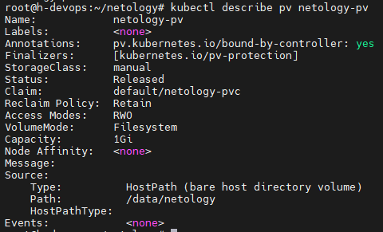
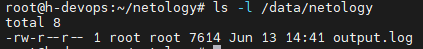
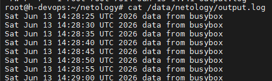
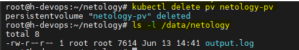
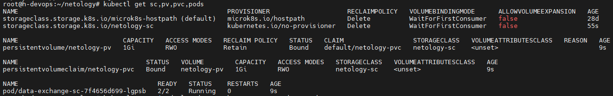
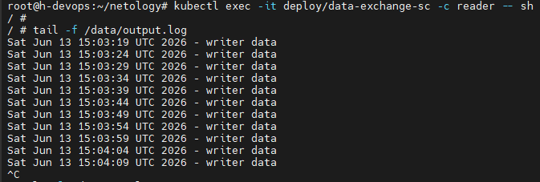
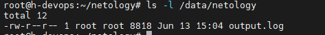

# Домашнее задание к занятию «Хранение в K8s»

### Примерное время выполнения задания — 180 минут

### Цель задания

Научиться работать с хранилищами в тестовой среде Kubernetes:
- обеспечить обмен файлами между контейнерами пода;
- создавать **PersistentVolume** (PV) и использовать его в подах через **PersistentVolumeClaim** (PVC);
- объявлять свой **StorageClass** (SC) и монтировать его в под через **PVC**.

Это задание поможет вам освоить базовые принципы взаимодействия с хранилищами в Kubernetes — одного из ключевых навыков для работы с кластерами. На практике Volume, PV, PVC используются для хранения данных независимо от пода, обмена данными между подами и контейнерами внутри пода. Понимание этих механизмов поможет вам упростить проектирование слоя данных для приложений, разворачиваемых в кластере k8s.

------

## **Подготовка**
### **Чеклист готовности**

1. Установленное K8s-решение (допустим, MicroK8S).
2. Установленный локальный kubectl.
3. Редактор YAML-файлов с подключенным GitHub-репозиторием.

------

### Инструменты, которые пригодятся для выполнения задания

1. [Инструкция](https://microk8s.io/docs/getting-started) по установке MicroK8S.
2. [Инструкция](https://minikube.sigs.k8s.io/docs/start/?arch=%2Fwindows%2Fx86-64%2Fstable%2F.exe+download) по установке Minikube. 
3. [Инструкция](https://kubernetes.io/docs/tasks/tools/install-kubectl-windows/) по установке kubectl.
4. [Инструкция](https://marketplace.visualstudio.com/items?itemName=ms-kubernetes-tools.vscode-kubernetes-tools) по установке VS Code

### Дополнительные материалы, которые пригодятся для выполнения задания
1. [Описание Volumes](https://kubernetes.io/docs/concepts/storage/volumes/).
2. [Описание Ephemeral Volumes](https://kubernetes.io/docs/concepts/storage/volumes/).
3. [Описание PersistentVolume](https://kubernetes.io/docs/concepts/storage/persistent-volumes/).
4. [Описание PersistentVolumeClaim](https://kubernetes.io/docs/concepts/storage/persistent-volumes/#persistentvolumeclaims).
5. [Описание StorageClass](https://kubernetes.io/docs/concepts/storage/storage-classes/).
6. [Описание Multitool](https://github.com/wbitt/Network-MultiTool).

------

# Задание 1. Volume: обмен данными между контейнерами в поде
### Задача

Создать Deployment приложения, состоящего из двух контейнеров, обменивающихся данными.

### Шаги выполнения
1. Создать Deployment приложения, состоящего из контейнеров busybox и multitool.
2. Настроить busybox на запись данных каждые 5 секунд в некий файл в общей директории.
3. Обеспечить возможность чтения файла контейнером multitool.


### Что сдать на проверку
- Манифесты:
  - `containers-data-exchange.yaml`
- Скриншоты:
  - описание пода с контейнерами (`kubectl describe pods data-exchange`)
  - вывод команды чтения файла (`tail -f <имя общего файла>`)


# Решение


Для обмена данными между контейнерами в одном Pod используется том `emptyDir`.

Особенности `emptyDir`:
- создаётся вместе с Pod;
- доступен всем контейнерам внутри Pod;
- удаляется при удалении Pod;
- подходит для временного обмена данными между контейнерами.


Файл манифеста [`containers-data-exchange.yaml`](./containers-data-exchange.yaml)

### Применение манифеста

```bash
kubectl apply -f containers-data-exchange.yaml
```

### Проверка Pod

```bash
kubectl get pods
```


### Описание Pod

```bash
kubectl describe pod data-exchange-c45f999d6-nknlg
```

Скриншот этой команды:


### Проверка обмена данными

Подключаемся в контейнер multitool:

```bash
kubectl exec -it deployment/data-exchange -c multitool -- sh
```

Проверяем содержимое файла:

```bash
tail -f /shared/data.txt
```


# Итог

Создан Deployment с двумя контейнерами:
- busybox записывает данные в файл каждые 5 секунд;
- multitool читает тот же файл;
- обмен данными организован через общий том `emptyDir`.


------

# Задание 2. PV, PVC
## Задача
Создать Deployment приложения, использующего локальный PV, созданный вручную.

### Шаги выполнения
1. Создать Deployment приложения, состоящего из контейнеров busybox и multitool, использующего созданный ранее PVC
2. Создать PV и PVC для подключения папки на локальной ноде, которая будет использована в поде.
3. Продемонстрировать, что контейнер multitool может читать данные из файла в смонтированной директории, в который busybox записывает данные каждые 5 секунд. 
4. Удалить Deployment и PVC. Продемонстрировать, что после этого произошло с PV. Пояснить, почему. (Используйте команду `kubectl describe pv`).
5. Продемонстрировать, что файл сохранился на локальном диске ноды. Удалить PV.  Продемонстрировать, что произошло с файлом после удаления PV. Пояснить, почему.


### Что сдать на проверку
- Манифесты:
  - `pv-pvc.yaml`
- Скриншоты:
  - каждый шаг выполнения задания, начиная с шага 2.
- Описания:
  - объяснение наблюдаемого поведения ресурсов в двух последних шагах.

# Решение

### Шаг 1. Создание PV и PVC

Для локального хранения создадим каталог на ноде.

Например:

```bash
sudo mkdir -p /data/netology
sudo chmod 777 /data/netology
```

[Манифест `pv-pvc.yaml`](./pv-pvc.yaml)

### Шаг 2. Создание ресурсов

```bash
kubectl apply -f pv-pvc.yaml
```

Проверка:

```bash
kubectl get pv,pvc,pods
```


### Шаг 3. Проверка обмена данными

Подключаемся к контейнеру multitool:

```bash
kubectl exec -it deploy/data-exchange -c multitool -- sh
```

Читаем файл:

```bash
tail -f /data/output.log
```


Читаем файл на хосте:

```bash

```

---

### Шаг 4. Удаление Deployment и PVC

Удаляем Deployment:

```bash
kubectl delete deployment data-exchange
```

Удаляем PVC:

```bash
kubectl delete pvc netology-pvc
```

Проверяем PV:

```bash
kubectl get pv
```


Дополнительно:

```bash
kubectl describe pv netology-pv
```



### Что произошло с PV?

После удаления PVC:

- PV не удаляется из-за политики Retain
- в кластере MicroK8s PV переходит в статус Available, а не Released
- это связано с использованием dynamic storage provisioner (microk8s-hostpath)
- Kubernetes не выполняет очистку данных на hostPath


Политика `Retain` запрещает Kubernetes автоматически удалять данные и сам PV после удаления PVC.

Это сделано для защиты данных от случайного удаления.

---

### Шаг 5. Проверка файла на ноде

Подключаемся к ноде:

```bash
ls -l /data/netology
```



Проверяем содержимое:

```bash
cat /data/netology/output.log
```



Файл сохранился.


### Удаление PV

```bash
kubectl delete pv netology-pv
```

Проверяем каталог:

```bash
ls -l /data/netology
```

Файл по-прежнему существует:



### Почему файл не удалился?

Использовался тип тома:

```yaml
hostPath:
  path: /data/netology
```

Файлы физически находятся на диске ноды.

Удаление объекта Kubernetes:

```text
PersistentVolume
```

удаляет только описание ресурса из API Kubernetes.

Сам каталог и файлы Kubernetes не удаляет.

---


## Задание 3. StorageClass
### Задача
Создать Deployment приложения, использующего PVC, созданный на основе StorageClass.

### Шаги выполнения

1. Создать Deployment приложения, состоящего из контейнеров busybox и multitool, использующего созданный ранее PVC.
2. Создать SC и PVC для подключения папки на локальной ноде, которая будет использована в поде.
3. Продемонстрировать, что контейнер multitool может читать данные из файла в смонтированной директории, в который busybox записывает данные каждые 5 секунд.

### Что сдать на проверку
- Манифесты:
  - `sc.yaml`
- Скриншоты:
  - каждый шаг выполнения задания, начиная с шага 2
---
## Шаблоны манифестов с учебными комментариями
### 1. Deployment (containers-data-exchange.yaml)
```yaml
apiVersion: apps/v1
kind: Deployment
metadata:
  name: data-exchange
spec:
  replicas: # ЗАДАНИЕ: Укажите количество реплик
  selector:
    matchLabels:
      app: # ДОПОЛНИТЕ: Метка для селектора
  template:
    metadata:
      labels:
        app: # ПОВТОРИТЕ: Метка из selector.matchLabels
    spec:
      containers:
      - name: # ДОПОЛНИТЕ: Имя первого контейнера
        image: busybox
        command: ["/bin/sh", "-c"] 
        args: ["echo $(date) > путь_к_файлу; sleep 3600"] # КЛЮЧЕВОЕ: Команда записи данных в файл в директории из секции volumeMounts контейнера
        volumeMounts:
        - name: # ДОПОЛНИТЕ: Имя монтируемого раздела. Должно совпадать с именем эфемерного хранилища, объявленного на уровне пода.
          mountPath: # КЛЮЧЕВОЕ: Путь монтирования эфемерного хранилища внутри контейнера 1
      - name: # ДОПОЛНИТЕ: Имя второго контейнера
        image: busybox
        command: ["/bin/sh", "-c"]
        args: ["tail -f путь_к_файлу"] # КЛЮЧЕВОЕ: Команда для чтения данных из файла, расположенного в директории, указанной в volumeMounts контейнера
        volumeMounts:
        - name: # ДОПОЛНИТЕ: Имя монтируемого раздела. Должно совпадать с именем эфемерного хранилища, объявленного на уровне пода
          mountPath: # КЛЮЧЕВОЕ: Путь монтирования эфемерного хранилища внутри контейнера 2
      volumes:
      - name: # ДОПОЛНИТЕ: Имя монтируемого раздела эфемерного хранилища
        emptyDir: {} # ИНФОРМАЦИЯ: Определяем эфемерное хранилище, которое работает только внутри пода
```
### 2. Deployment (pv-pvc.yaml)
```yaml
---
apiVersion: v1
kind: PersistentVolume
metadata:
  name: # ДОПОЛНИТЕ: Имя хранилища
spec:
  capacity:
    storage: 1Gi
  volumeMode: Filesystem
  accessModes:
    - ReadWriteOnce
  persistentVolumeReclaimPolicy: Retain
  hostPath:
    path: # КЛЮЧЕВОЕ: Путь к директории на ноде (хосте, на котором развёрнут кластер)
---
apiVersion: v1
kind: PersistentVolumeClaim
metadata:
  name: # ДОПОЛНИТЕ: Имя PVC
spec:
  volumeName: # ДОПОЛНИТЕ: Имя PV, к которому будет привязан PVC, должен совпадать с созданным ранее PV
  volumeMode: Filesystem
  accessModes:
    - ReadWriteOnce
  resources:
    requests:
      storage: # ДОПОЛНИТЕ: Какой объём хранилища вы хотите передать в контейнер. Должно быть меньше или равно параметру storage из PV
---
apiVersion: apps/v1
kind: Deployment
metadata:
  name: data-exchange-pvc
spec:
  replicas: # ЗАДАНИЕ: Укажите количество реплик
  selector:
    matchLabels:
      app: # ДОПОЛНИТЕ: Метка для селектора
  template:
    metadata:
      labels:
        app: # ПОВТОРИТЕ: Метка из selector.matchLabels
    spec:
      containers:
      - name: # ДОПОЛНИТЕ: Имя первого контейнера
        image: busybox
        command: ["/bin/sh", "-c"] 
        args: ["echo $(date) > путь_к_файлу; sleep 3600"] # КЛЮЧЕВОЕ: Команда записи данных в файл в директории из секции volumeMounts контейнера 
        volumeMounts:
        - name: # ДОПОЛНИТЕ: Имя монтируемого раздела. Должно совпадать с именем хранилища, объявленного на уровне пода
          mountPath: # КЛЮЧЕВОЕ: Путь монтирования хранилища внутри контейнера 1
      - name: # ДОПОЛНИТЕ: Имя второго контейнера
        image: busybox
        command: ["/bin/sh", "-c"]
        args: ["tail -f путь_к_файлу"] # КЛЮЧЕВОЕ: Команда для чтения данных из файла, расположенного в директории, указанной в volumeMounts контейнера
        volumeMounts:
        - name: # ДОПОЛНИТЕ: Имя монтируемого раздела. Должно совпадать с именем хранилища, объявленного на уровне пода
          mountPath: # КЛЮЧЕВОЕ: Путь монтирования хранилища внутри контейнера 2
      volumes:
      - name: # ДОПОЛНИТЕ: Имя монтируемого раздела хранилища
        persistentVolumeClaim:
          claimName: # КЛЮЧЕВОЕ: Совпадает с именем PVC объявленного ранее
```
### 3. Deployment (sc.yaml)
```yaml
apiVersion: storage.k8s.io/v1
kind: StorageClass
metadata:
  name: # ДОПОЛНИТЕ: Имя StorageClass
provisioner: kubernetes.io/no-provisioner # ИНФОРМАЦИЯ: Нет автоматического развёртывания
volumeBindingMode: WaitForFirstConsumer
---
apiVersion: v1
kind: PersistentVolumeClaim
metadata:
  name: # ДОПОЛНИТЕ: Имя PVC
spec:
  volumeMode: Filesystem
  accessModes:
    - ReadWriteOnce
  resources:
    requests:
      storage: # ДОПОЛНИТЕ: Какой объем хранилища вы хотите передать в контейнер. Должно быть меньше или равно параметру storage из PV
  storageClassName: # ДОПОЛНИТЕ: Имя StorageClass. Должно совпадать с объявленным ранее
---
apiVersion: apps/v1
kind: Deployment
metadata:
  name: data-exchange-sc
spec:
  replicas: # ЗАДАНИЕ: Укажите количество реплик
  selector:
    matchLabels:
      app: # ДОПОЛНИТЕ: Метка для селектора
  template:
    metadata:
      labels:
        app: # ПОВТОРИТЕ: Метка из selector.matchLabels
    spec:
      containers:
      - name: # ДОПОЛНИТЕ: Имя первого контейнера
        image: busybox
        command: ["/bin/sh", "-c"] 
        args: ["echo $(date) > путь_к_файлу; sleep 3600"] # КЛЮЧЕВОЕ: Команда для чтения данных из файла, расположенного в директории, указанной в volumeMounts контейнера
        volumeMounts:
        - name: # ДОПОЛНИТЕ: Имя монтируемого раздела. Должно совпадать с именем хранилища, объявленного на уровне пода
          mountPath: # КЛЮЧЕВОЕ: Путь монтирования хранилища внутри контейнера 1
      - name: # ДОПОЛНИТЕ: Имя второго контейнера
        image: busybox
        command: ["/bin/sh", "-c"]
        args: ["tail -f путь_к_файлу"] # КЛЮЧЕВОЕ: Команда для чтения данных из файла, расположенного в директории, указанной в volumeMounts контейнера
        volumeMounts:
        - name: # ДОПОЛНИТЕ: Имя монтируемого раздела. Должно совпадать с именем хранилища, объявленного на уровне пода
          mountPath: # КЛЮЧЕВОЕ: Путь монтирования хранилища внутри контейнера 2
      volumes:
      - name: # ДОПОЛНИТЕ: Имя монтируемого раздела хранилища
        persistentVolumeClaim:
          claimName: # КЛЮЧЕВОЕ: Совпадает с именем PVC объявленного ранее
```

# Решение

[Манифест `sc.yaml`](./sc.yaml)


### Применение

```bash
kubectl apply -f sc.yaml
kubectl apply -f containers-data-exchange.yaml
```

### Проверка

```bash
kubectl get sc,pv,pvc,pods
```


### Проверка обмена данными 

```bash
kubectl exec -it deploy/data-exchange-sc -c reader -- sh
tail -f /data/output.log
```



### Проверка на ноде

```bash
ls -l /data/netology
cat /data/netology/output.log
```



## **Правила приёма работы**
1. Домашняя работа оформляется в своём Git-репозитории в файле README.md. Выполненное домашнее задание пришлите ссылкой на .md-файл в вашем репозитории.
2. Файл README.md должен содержать скриншоты вывода необходимых команд `kubectl`, скриншоты результатов, пояснения.
3. Репозиторий должен содержать тексты манифестов или ссылки на них в файле README.md.

## **Критерии оценивания задания**
1. Зачёт: Все задачи выполнены, манифесты корректны, есть доказательства работы (скриншоты) и пояснения по заданию 2.
2. Доработка (на доработку задание направляется 1 раз): основные задачи выполнены, при этом есть ошибки в манифестах или отсутствуют проверочные скриншоты.
3. Незачёт: работа выполнена не в полном объёме, есть ошибки в манифестах, отсутствуют проверочные скриншоты. Все попытки доработки израсходованы (на доработку работа направляется 1 раз). Этот вид оценки используется крайне редко.

## **Срок выполнения задания**  
1. 5 дней на выполнение задания.
2. 5 дней на доработку задания (в случае направления задания на доработку).