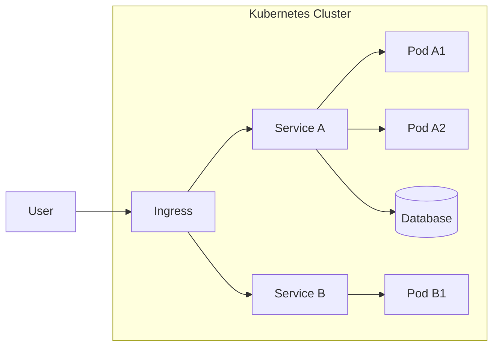
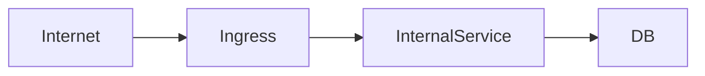
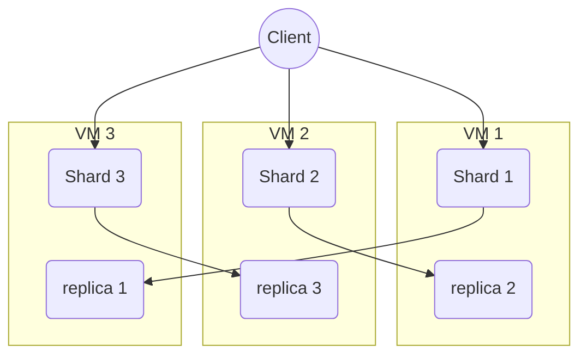
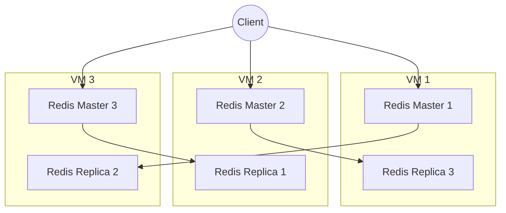
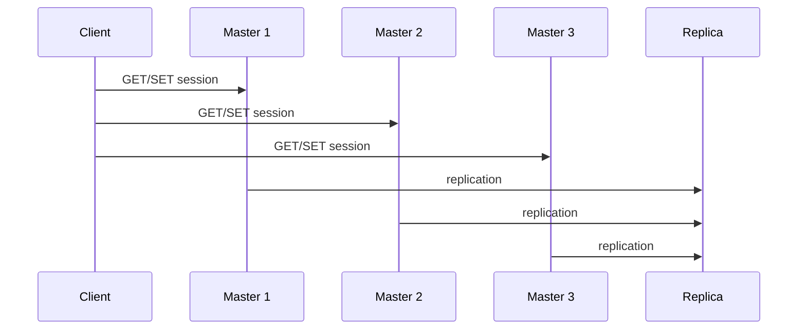

# Домашнее задание к занятию «Микросервисы: масштабирование»

Вы работаете в крупной компании, которая строит систему на основе микросервисной архитектуры.
Вам как DevOps-специалисту необходимо выдвинуть предложение по организации инфраструктуры для разработки и эксплуатации.

## Задача 1: Кластеризация

Предложите решение для обеспечения развёртывания, запуска и управления приложениями.
Решение может состоять из одного или нескольких программных продуктов и должно описывать способы и принципы их взаимодействия.

Решение должно соответствовать следующим требованиям:
- поддержка контейнеров;
- обеспечивать обнаружение сервисов и маршрутизацию запросов;
- обеспечивать возможность горизонтального масштабирования;
- обеспечивать возможность автоматического масштабирования;
- обеспечивать явное разделение ресурсов, доступных извне и внутри системы;
- обеспечивать возможность конфигурировать приложения с помощью переменных среды, в том числе с возможностью безопасного хранения чувствительных данных таких как пароли, ключи доступа, ключи шифрования и т. п.

Обоснуйте свой выбор.

# Решение

Для управления микросервисной архитектурой предлагается использовать Kubernetes как основную платформу оркестрации контейнеров.

---

## Выбранное решение

| Компонент | Решение |
|---|---|
| Оркестрация контейнеров | Kubernetes |
| Контейнеризация | Docker / containerd |
| Ingress / маршрутизация | NGINX Ingress Controller / Traefik |
| Service Discovery | Kubernetes Services (ClusterIP) |
| Autoscaling | HPA / VPA / Cluster Autoscaler |
| Конфигурация | ConfigMap + Secret |
| Секреты | Kubernetes Secrets / Vault (опционально HashiCorp Vault) |

---

## Обоснование выбора

Kubernetes выбран как стандарт де-факто для микросервисных архитектур благодаря:

- поддержке контейнеров (Docker/containerd);
- встроенному service discovery;
- гибкой системе маршрутизации;
- автоматическому масштабированию;
- декларативному управлению инфраструктурой;
- развитой экосистеме;
- поддержке облаков и on-prem решений.

---

## Архитектура системы



---

## Поддержка контейнеров

Kubernetes использует:
- containerd (или Docker runtime)
- OCI-совместимые образы

Каждое приложение:
- упаковывается в Docker image;
- запускается в Pod;
- управляется Deployment/StatefulSet.

---

## Service Discovery и маршрутизация

### Service Discovery

Внутри кластера:
- каждый сервис получает DNS-имя
- например:
  ```
  http://service-a.default.svc.cluster.local
  ```

### Маршрутизация

Внешний трафик проходит через:
- Ingress Controller

Пример:
- NGINX Ingress
- Traefik

---

## Горизонтальное масштабирование

### HPA (Horizontal Pod Autoscaler)

```yaml id="hpa1"
apiVersion: autoscaling/v2
kind: HorizontalPodAutoscaler
spec:
  scaleTargetRef:
    kind: Deployment
    name: service-a
  minReplicas: 2
  maxReplicas: 10
  metrics:
  - type: Resource
    resource:
      name: cpu
      target:
        type: Utilization
        averageUtilization: 70
```

---

## Автоматическое масштабирование

Поддерживается на уровнях:

### 1. Pod scaling
- HPA

### 2. Node scaling
- Cluster Autoscaler

### 3. Event-driven scaling (опционально)
- KEDA

---

## Разделение внешнего и внутреннего доступа

### Внутренние сервисы
- type: ClusterIP
- доступны только внутри кластера

### Внешние сервисы
- type: LoadBalancer
- или Ingress

---



---

## Конфигурация приложений

### ConfigMap

Используется для:
- конфигурации приложений;
- non-sensitive данных.

### Secret

Используется для:
- паролей;
- API ключей;
- сертификатов;
- токенов.

---

Пример Secret:

```yaml id="sec1"
apiVersion: v1
kind: Secret
metadata:
  name: app-secret
type: Opaque
data:
  password: cXdlcnR5MTIz
```

---

## Безопасное хранение секретов

Дополнительно рекомендуется:

### HashiCorp Vault

Преимущества:
- динамические секреты;
- audit log;
- rotation;
- интеграция с Kubernetes.

---

## Принципы работы системы

- каждый сервис — отдельный Deployment
- независимое масштабирование сервисов
- автоматическое распределение нагрузки
- self-healing (перезапуск Pod при падении)
- декларативная инфраструктура (YAML manifests)

---

## Соответствие требованиям

| Требование | Реализация |
|---|---|
| Контейнеры | Docker / containerd |
| Service Discovery | Kubernetes DNS |
| Маршрутизация | Ingress Controller |
| Горизонтальное масштабирование | HPA |
| Автоскейлинг | HPA + Cluster Autoscaler |
| Разделение доступа | ClusterIP / LoadBalancer |
| Конфигурация | ConfigMap |
| Секреты | Secrets / Vault |

---

## Итог

Kubernetes обеспечивает полноценную платформу для:
- развертывания микросервисов;
- масштабирования;
- маршрутизации трафика;
- управления конфигурациями;
- безопасного хранения секретов;
- автоматического восстановления и балансировки нагрузки.

Это делает его оптимальным выбором для микросервисной архитектуры в production-среде.


## Задача 2: Распределённый кеш * (необязательная)

Разработчикам вашей компании понадобился распределённый кеш для организации хранения временной информации по сессиям пользователей.
Вам необходимо построить Redis Cluster, состоящий из трёх шард с тремя репликами.

### Схема:


# Решение

# Задача 2: Распределённый кеш (Redis Cluster)

## Цель

Построить Redis Cluster для хранения сессионных данных пользователей:

- 3 шардированных master-ноды
- 3 реплики (по одной на каждый shard)
- отказоустойчивость
- автоматическое восстановление при сбоях

---

# Архитектура решения



---

# Обоснование выбора

## Redis Cluster выбран потому что:

- поддерживает **sharding (распределение ключей)**
- обеспечивает **replication (реплики)**
- имеет **автоматический failover**
- обеспечивает **высокую скорость доступа**
- подходит для хранения **session / cache данных**
- минимальная задержка (in-memory storage)

---

# Топология кластера

## Узлы:

| VM | Роль |
|---|---|
| VM1 | Master 1 + Replica 3 |
| VM2 | Master 2 + Replica 1 |
| VM3 | Master 3 + Replica 2 |

---

## Распределение ролей

| Shard | Master | Replica |
|---|---|---|
| Shard 1 | VM1 | VM2 |
| Shard 2 | VM2 | VM3 |
| Shard 3 | VM3 | VM1 |

---

# Принцип работы

## 1. Шардирование

Redis Cluster автоматически:
- делит keyspace на hash slots (16384)
- распределяет ключи между master-нодами

---

## 2. Репликация

Каждый master имеет реплику на другом узле:

- асинхронная репликация
- автоматическое обновление данных

---

## 3. Failover

При падении master:

- replica становится новым master
- cluster продолжает работу без вмешательства

---

# Поток запросов



---

# Настройка Redis Cluster (пример)

## Шаг 1: запуск узлов

Каждая VM содержит Redis:

```bash id="r1"
redis-server --port 7000 --cluster-enabled yes \
--cluster-config-file nodes.conf \
--cluster-node-timeout 5000 \
--appendonly yes
```

---

## Шаг 2: создание кластера

```bash id="r2"
redis-cli --cluster create \
vm1:7000 vm2:7000 vm3:7000 \
vm1:7001 vm2:7001 vm3:7001 \
--cluster-replicas 1
```

---

# Использование для сессий

## Пример ключей:

```text id="sess1"
session:user:12345 -> data
session:user:67890 -> data
```

---

## TTL для кеша

```bash id="ttl1"
EXPIRE session:user:12345 3600
```

---

# Отказоустойчивость

## Что происходит при падении VM:

- replica автоматически становится master
- данные сохраняются
- клиент переподключается к новому master

---

# Масштабирование

Redis Cluster позволяет:
- добавлять новые master-ноды
- перераспределять hash slots
- увеличивать пропускную способность

---

# Соответствие требованиям

| Требование | Реализация |
|---|---|
| Распределённый кеш | Redis Cluster |
| 3 шарда | 3 master-ноды |
| 3 реплики | 3 replica-ноды |
| Отказоустойчивость | Failover механизм |
| Высокая скорость | In-memory storage |
| Сессии пользователей | Key TTL + session keys |

---

# Итог

Redis Cluster обеспечивает:
- распределённое хранение сессий;
- высокую скорость доступа;
- автоматическое восстановление при сбоях;
- горизонтальное масштабирование;
- отказоустойчивость без внешних координаторов.

Это оптимальное решение для session storage в микросервисной архитектуре.
```

---

### Как оформить ДЗ?

Выполненное домашнее задание пришлите ссылкой на .md-файл в вашем репозитории.

---