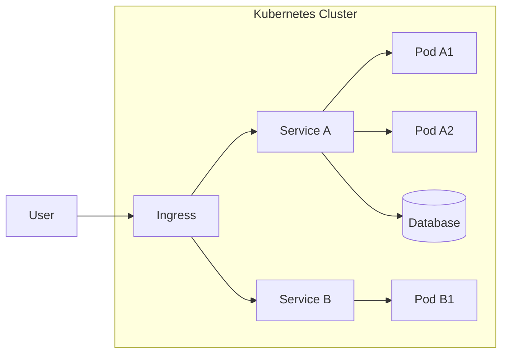
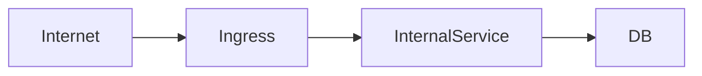

# Домашнее задание к занятию «Микросервисы: масштабирование»

Вы работаете в крупной компании, которая строит систему на основе микросервисной архитектуры.
Вам как DevOps-специалисту необходимо выдвинуть предложение по организации инфраструктуры для разработки и эксплуатации.

## Задача 1: Кластеризация

Предложите решение для обеспечения развёртывания, запуска и управления приложениями.
Решение может состоять из одного или нескольких программных продуктов и должно описывать способы и принципы их взаимодействия.

Решение должно соответствовать следующим требованиям:
- поддержка контейнеров;
- обеспечивать обнаружение сервисов и маршрутизацию запросов;
- обеспечивать возможность горизонтального масштабирования;
- обеспечивать возможность автоматического масштабирования;
- обеспечивать явное разделение ресурсов, доступных извне и внутри системы;
- обеспечивать возможность конфигурировать приложения с помощью переменных среды, в том числе с возможностью безопасного хранения чувствительных данных таких как пароли, ключи доступа, ключи шифрования и т. п.

Обоснуйте свой выбор.

# Решение

# Задача 1: Кластеризация

Для управления микросервисной архитектурой предлагается использовать Kubernetes как основную платформу оркестрации контейнеров.

---

# Выбранное решение

| Компонент | Решение |
|---|---|
| Оркестрация контейнеров | Kubernetes |
| Контейнеризация | Docker / containerd |
| Ingress / маршрутизация | NGINX Ingress Controller / Traefik |
| Service Discovery | Kubernetes Services (ClusterIP) |
| Autoscaling | HPA / VPA / Cluster Autoscaler |
| Конфигурация | ConfigMap + Secret |
| Секреты | Kubernetes Secrets / Vault (опционально HashiCorp Vault) |

---

# Обоснование выбора

Kubernetes выбран как стандарт де-факто для микросервисных архитектур благодаря:

- поддержке контейнеров (Docker/containerd);
- встроенному service discovery;
- гибкой системе маршрутизации;
- автоматическому масштабированию;
- декларативному управлению инфраструктурой;
- развитой экосистеме;
- поддержке облаков и on-prem решений.

---

# Архитектура системы



---

# Поддержка контейнеров

Kubernetes использует:
- containerd (или Docker runtime)
- OCI-совместимые образы

Каждое приложение:
- упаковывается в Docker image;
- запускается в Pod;
- управляется Deployment/StatefulSet.

---

# Service Discovery и маршрутизация

## Service Discovery

Внутри кластера:
- каждый сервис получает DNS-имя
- например:
  ```
  http://service-a.default.svc.cluster.local
  ```

## Маршрутизация

Внешний трафик проходит через:
- Ingress Controller

Пример:
- NGINX Ingress
- Traefik

---

# Горизонтальное масштабирование

## HPA (Horizontal Pod Autoscaler)

```yaml id="hpa1"
apiVersion: autoscaling/v2
kind: HorizontalPodAutoscaler
spec:
  scaleTargetRef:
    kind: Deployment
    name: service-a
  minReplicas: 2
  maxReplicas: 10
  metrics:
  - type: Resource
    resource:
      name: cpu
      target:
        type: Utilization
        averageUtilization: 70
```

---

# Автоматическое масштабирование

Поддерживается на уровнях:

## 1. Pod scaling
- HPA

## 2. Node scaling
- Cluster Autoscaler

## 3. Event-driven scaling (опционально)
- KEDA

---

# Разделение внешнего и внутреннего доступа

## Внутренние сервисы
- type: ClusterIP
- доступны только внутри кластера

## Внешние сервисы
- type: LoadBalancer
- или Ingress

---



---

# Конфигурация приложений

## ConfigMap

Используется для:
- конфигурации приложений;
- non-sensitive данных.

## Secret

Используется для:
- паролей;
- API ключей;
- сертификатов;
- токенов.

---

Пример Secret:

```yaml id="sec1"
apiVersion: v1
kind: Secret
metadata:
  name: app-secret
type: Opaque
data:
  password: cXdlcnR5MTIz
```

---

# Безопасное хранение секретов

Дополнительно рекомендуется:

## HashiCorp Vault

Преимущества:
- динамические секреты;
- audit log;
- rotation;
- интеграция с Kubernetes.

---

# Принципы работы системы

- каждый сервис — отдельный Deployment
- независимое масштабирование сервисов
- автоматическое распределение нагрузки
- self-healing (перезапуск Pod при падении)
- декларативная инфраструктура (YAML manifests)

---

# Соответствие требованиям

| Требование | Реализация |
|---|---|
| Контейнеры | Docker / containerd |
| Service Discovery | Kubernetes DNS |
| Маршрутизация | Ingress Controller |
| Горизонтальное масштабирование | HPA |
| Автоскейлинг | HPA + Cluster Autoscaler |
| Разделение доступа | ClusterIP / LoadBalancer |
| Конфигурация | ConfigMap |
| Секреты | Secrets / Vault |

---

# Итог

Kubernetes обеспечивает полноценную платформу для:
- развертывания микросервисов;
- масштабирования;
- маршрутизации трафика;
- управления конфигурациями;
- безопасного хранения секретов;
- автоматического восстановления и балансировки нагрузки.

Это делает его оптимальным выбором для микросервисной архитектуры в production-среде.
```


## Задача 2: Распределённый кеш * (необязательная)

Разработчикам вашей компании понадобился распределённый кеш для организации хранения временной информации по сессиям пользователей.
Вам необходимо построить Redis Cluster, состоящий из трёх шард с тремя репликами.

### Схема:


---

### Как оформить ДЗ?

Выполненное домашнее задание пришлите ссылкой на .md-файл в вашем репозитории.

---