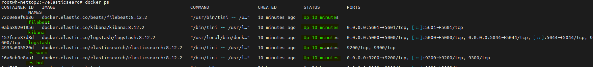
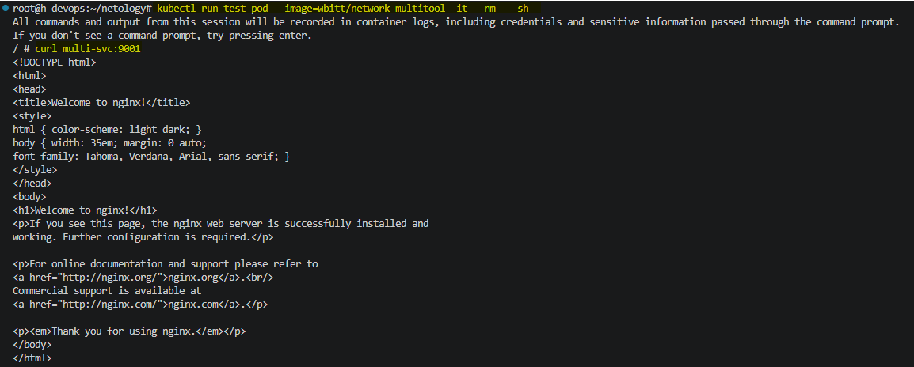
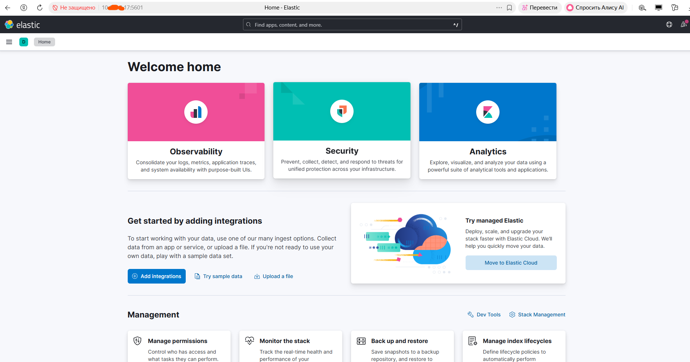
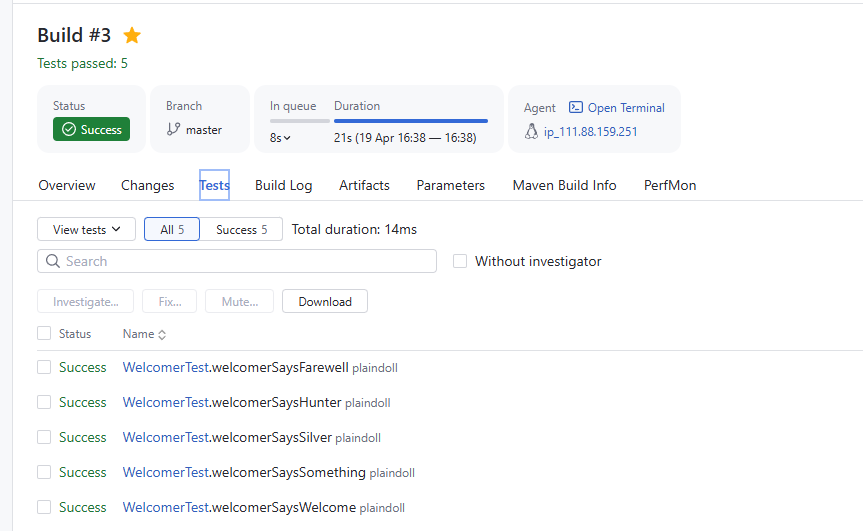
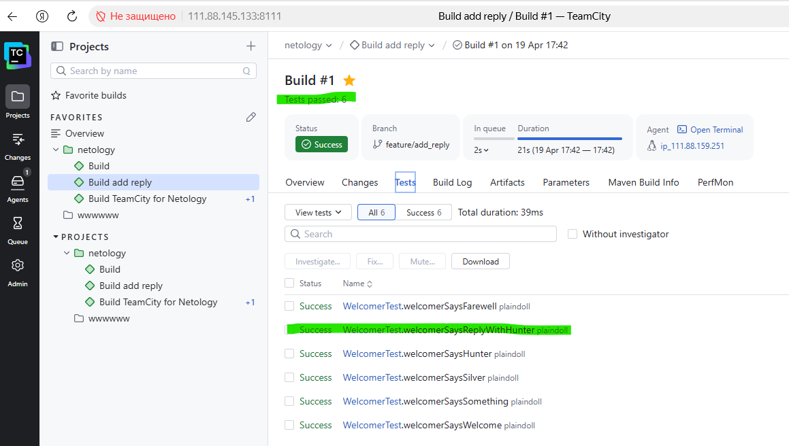
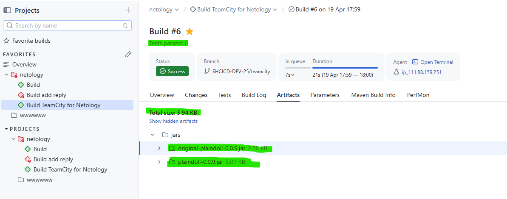
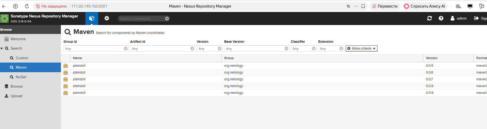

# Домашнее задание к занятию 11 «Teamcity»

## Подготовка к выполнению

1. В Yandex Cloud создайте новый инстанс (4CPU4RAM) на основе образа `jetbrains/teamcity-server`.
2. Дождитесь запуска teamcity, выполните первоначальную настройку.
3. Создайте ещё один инстанс (2CPU4RAM) на основе образа `jetbrains/teamcity-agent`. Пропишите к нему переменную окружения `SERVER_URL: "http://<teamcity_url>:8111"`.
4. Авторизуйте агент.
5. Сделайте fork [репозитория](https://github.com/aragastmatb/example-teamcity).
6. Создайте VM (2CPU4RAM) и запустите [playbook](./infrastructure).

## Основная часть

1. Создайте новый проект в teamcity на основе fork.
2. Сделайте autodetect конфигурации.
3. Сохраните необходимые шаги, запустите первую сборку master.
4. Поменяйте условия сборки: если сборка по ветке `master`, то должен происходит `mvn clean deploy`, иначе `mvn clean test`.
5. Для deploy будет необходимо загрузить [settings.xml](./teamcity/settings.xml) в набор конфигураций maven у teamcity, предварительно записав туда креды для подключения к nexus.
6. В pom.xml необходимо поменять ссылки на репозиторий и nexus.
7. Запустите сборку по master, убедитесь, что всё прошло успешно и артефакт появился в nexus.
8. Мигрируйте `build configuration` в репозиторий.
9. Создайте отдельную ветку `feature/add_reply` в репозитории.
10. Напишите новый метод для класса Welcomer: метод должен возвращать произвольную реплику, содержащую слово `hunter`.
11. Дополните тест для нового метода на поиск слова `hunter` в новой реплике.
12. Сделайте push всех изменений в новую ветку репозитория.
13. Убедитесь, что сборка самостоятельно запустилась, тесты прошли успешно.
14. Внесите изменения из произвольной ветки `feature/add_reply` в `master` через `Merge`.
15. Убедитесь, что нет собранного артефакта в сборке по ветке `master`.
16. Настройте конфигурацию так, чтобы она собирала `.jar` в артефакты сборки.
17. Проведите повторную сборку мастера, убедитесь, что сбора прошла успешно и артефакты собраны.
18. Проверьте, что конфигурация в репозитории содержит все настройки конфигурации из teamcity.
19. В ответе пришлите ссылку на репозиторий.

---

### Как оформить решение задания

Выполненное домашнее задание пришлите в виде ссылки на .md-файл в вашем репозитории.

---

## Решение

Созданы виртуальные машины для отработки за домашнего задания



Первый проббный запуск сборки



Артефакты сборки помещаются в Nexus



Успешное прохождение тестов



## Вторая часть. На стнове новой ветки feature/add_reply

Создаем ветку `feature/add_reply`

```bash
git checkout -b feature/add_reply
```

Добавляем новый метод в файл `src/main/java/plaindoll/Welcomer.java`

```java
package plaindoll;

public class Welcomer{
    .......
    .......
    public String sayReply(){
        return "Good hunter, you have done well.";
    }
}
```

Добавляем тест для нового метода

```java
package plaindoll;

import static org.hamcrest.CoreMatchers.containsString;
import static org.junit.Assert.*;
import org.junit.Test;

public class WelcomerTest {

    ........
    ...
    ........
    
    @Test
    public void welcomerSaysReplyWithHunter(){
        assertThat(welcomer.sayReply(), containsString("hunter"));
    }
}
```

Push изменений в новую ветку

```bash
git add src/main/java/plaindoll/Welcomer.java
git add src/test/java/plaindoll/WelcomerTest.java

git commit -m "feat: add sayReply method with hunter keyword"

git push origin feature/add_reply
```



```bash
# Переключение на ветку ДЗ
git checkout SHCICD-DEV-25/teamcity
git pull origin SHCICD-DEV-25/teamcity

# Сделайте mergefeature-ветки
git merge feature/add_reply

# Запушьте результат
git push origin SHCICD-DEV-25/teamcity
```

## Настройка публикации .jar в артефакты сборки

В разделе Artifact paths:

```java
target/*.jar => jars/
```



Все артефакты сборки в репозитории Nexus

