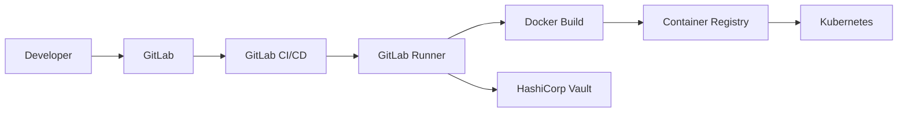
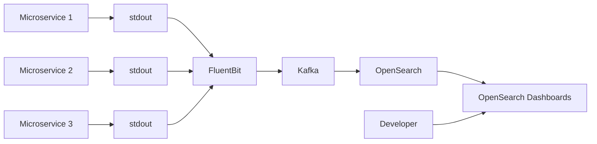
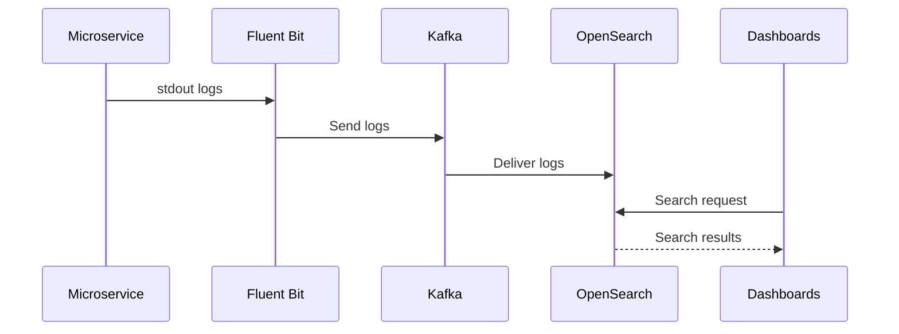

# Домашнее задание к занятию «Микросервисы: подходы»

Вы работаете в крупной компании, которая строит систему на основе микросервисной архитектуры.
Вам как DevOps-специалисту необходимо выдвинуть предложение по организации инфраструктуры для разработки и эксплуатации.


## Задача 1: Обеспечить разработку

Предложите решение для обеспечения процесса разработки: хранение исходного кода, непрерывная интеграция и непрерывная поставка. 
Решение может состоять из одного или нескольких программных продуктов и должно описывать способы и принципы их взаимодействия.

Решение должно соответствовать следующим требованиям:
- облачная система;
- система контроля версий Git;
- репозиторий на каждый сервис;
- запуск сборки по событию из системы контроля версий;
- запуск сборки по кнопке с указанием параметров;
- возможность привязать настройки к каждой сборке;
- возможность создания шаблонов для различных конфигураций сборок;
- возможность безопасного хранения секретных данных (пароли, ключи доступа);
- несколько конфигураций для сборки из одного репозитория;
- кастомные шаги при сборке;
- собственные докер-образы для сборки проектов;
- возможность развернуть агентов сборки на собственных серверах;
- возможность параллельного запуска нескольких сборок;
- возможность параллельного запуска тестов.

Обоснуйте свой выбор.

# Решение

Для организации процесса разработки и эксплуатации микросервисной архитектуры предлагается использовать следующий набор инструментов:

| Компонент | Решение |
|---|---|
| Система контроля версий | GitLab |
| CI/CD система | GitLab CI/CD |
| Хранение контейнеров | GitLab Container Registry |
| Хранение секретов | HashiCorp Vault |
| Среда выполнения build-агентов | GitLab Runner |
| Оркестрация контейнеров | Kubernetes |

---

## Обоснование выбора

В качестве основной платформы выбран GitLab, так как он предоставляет единое решение для:
- хранения исходного кода;
- CI/CD;
- управления пользователями;
- хранения Docker-образов;
- интеграции с Kubernetes;
- работы с Git.

Это позволяет сократить количество отдельных сервисов и упростить сопровождение инфраструктуры.

---

## Организация инфраструктуры

### Схема взаимодействия компонентов


---

## Описание компонентов

### GitLab

GitLab используется как:
- облачная система разработки;
- Git-репозиторий;
- система управления merge request;
- CI/CD платформа.

Для каждого микросервиса создаётся отдельный Git-репозиторий.

Это позволяет:
- независимо развивать сервисы;
- разграничивать права доступа;
- запускать отдельные pipeline;
- независимо версионировать сервисы.

---

### GitLab CI/CD

GitLab CI/CD используется для:
- автоматической сборки проектов;
- запуска тестов;
- публикации Docker-образов;
- доставки приложений в Kubernetes.

Pipeline запускаются:
- автоматически при push/merge;
- вручную через Web UI;
- по расписанию;
- через API.

---

### GitLab Runner

GitLab Runner используется как агент выполнения сборок.

Runner можно:
- размещать на собственных серверах;
- запускать в Docker;
- запускать в Kubernetes;
- масштабировать горизонтально.

Для разных типов задач можно использовать:
- отдельные Runner;
- теги;
- разные Docker-образы.

---

## Соответствие требованиям

| Требование | Реализация |
|---|---|
| Облачная система | GitLab Cloud / Self-hosted |
| Git | Используется GitLab |
| Репозиторий на каждый сервис | Отдельный repository |
| Запуск сборки по событию | Webhook и pipeline |
| Запуск по кнопке | Manual pipeline |
| Настройки для каждой сборки | Variables и pipeline parameters |
| Шаблоны сборок | `.gitlab-ci.yml`, include/templates |
| Хранение секретов | HashiCorp Vault / GitLab Secrets |
| Несколько конфигураций | Разные stages/jobs |
| Кастомные шаги | Script sections |
| Собственные Docker-образы | Custom build images |
| Собственные build-агенты | GitLab Runner |
| Параллельные сборки | Parallel jobs |
| Параллельные тесты | Parallel test execution |

---

## Работа с секретами

Для безопасного хранения секретных данных предлагается использовать HashiCorp Vault.

Vault обеспечивает:
- централизованное хранение секретов;
- динамические токены;
- контроль доступа;
- аудит использования секретов;
- интеграцию с GitLab CI/CD.

В pipeline секреты передаются во временные переменные окружения и не сохраняются в логах сборки.

---

## Использование Docker

Каждый сервис собирается в отдельный Docker-образ.

Преимущества:
- одинаковое окружение разработки и production;
- воспроизводимость сборок;
- изоляция зависимостей;
- упрощение доставки приложений.

Docker-образы хранятся в GitLab Container Registry.

---

## Использование Kubernetes

Kubernetes используется как платформа эксплуатации микросервисов.

Преимущества:
- автоматическое масштабирование;
- self-healing;
- rolling update;
- service discovery;
- отказоустойчивость.

GitLab CI/CD автоматически выполняет доставку новых версий сервисов в Kubernetes-кластер.

---

## Итог

Предложенное решение на базе GitLab CI/CD, GitLab Runner, Docker, Kubernetes и HashiCorp Vault позволяет:
- организовать полный цикл разработки;
- обеспечить автоматизацию CI/CD;
- безопасно хранить секреты;
- масштабировать инфраструктуру;
- поддерживать микросервисную архитектуру;
- выполнять параллельные сборки и тестирование;
- использовать собственные build-агенты и Docker-образы.


## Задача 2: Логи

Предложите решение для обеспечения сбора и анализа логов сервисов в микросервисной архитектуре.
Решение может состоять из одного или нескольких программных продуктов и должно описывать способы и принципы их взаимодействия.

Решение должно соответствовать следующим требованиям:
- сбор логов в центральное хранилище со всех хостов, обслуживающих систему;
- минимальные требования к приложениям, сбор логов из stdout;
- гарантированная доставка логов до центрального хранилища;
- обеспечение поиска и фильтрации по записям логов;
- обеспечение пользовательского интерфейса с возможностью предоставления доступа разработчикам для поиска по записям логов;
- возможность дать ссылку на сохранённый поиск по записям логов.

Обоснуйте свой выбор.

# Решение

Для организации централизованного сбора, хранения и анализа логов в микросервисной архитектуре предлагается использовать следующий стек:

| Компонент | Решение |
|---|---|
| Сбор логов | Fluent Bit |
| Буферизация и гарантированная доставка | Kafka |
| Центральное хранилище логов | OpenSearch |
| Визуализация и поиск | OpenSearch Dashboards |
| Оркестрация | Kubernetes |

---

## Обоснование выбора

Для микросервисной архитектуры критически важны:
- централизованный сбор логов;
- высокая производительность;
- отказоустойчивость;
- возможность масштабирования;
- удобный поиск;
- минимальные требования к приложениям.

Предлагаемый стек Fluent Bit + Kafka + OpenSearch обеспечивает выполнение всех требований и хорошо подходит для высоконагруженных распределённых систем.

---

## Схема взаимодействия компонентов



---

## Описание компонентов

### Fluent Bit

Fluent Bit используется как агент сбора логов.

Он устанавливается:
- на каждый сервер;
- либо как DaemonSet в Kubernetes.

Fluent Bit:
- считывает логи контейнеров;
- получает данные из stdout/stderr;
- добавляет метаданные;
- отправляет логи в Kafka.

Преимущества:
- низкое потребление ресурсов;
- высокая производительность;
- поддержка Kubernetes;
- поддержка буферизации;
- возможность обработки логов.

---

## Сбор логов из stdout

Все приложения должны писать логи в:
- stdout;
- stderr.

Это соответствует cloud-native подходу и не требует:
- отдельных log-файлов;
- дополнительной настройки приложений.

Контейнерная платформа автоматически перенаправляет stdout в систему логирования.

Пример:

```text
Application -> stdout -> Fluent Bit -> Kafka -> OpenSearch
```

---

## Kafka

Apache Kafka используется как промежуточный брокер сообщений.

Kafka обеспечивает:
- гарантированную доставку логов;
- буферизацию;
- защиту от потери данных;
- возможность повторного чтения;
- масштабирование системы логирования.

Даже при временной недоступности OpenSearch логи продолжают сохраняться в Kafka.

---

## OpenSearch

OpenSearch используется как центральное хранилище логов.

Основные возможности:
- полнотекстовый поиск;
- фильтрация;
- агрегация;
- хранение больших объёмов логов;
- быстрый поиск по индексам.

Для разных сервисов можно использовать:
- отдельные индексы;
- lifecycle policy;
- различные сроки хранения.

---

## OpenSearch Dashboards

OpenSearch Dashboards предоставляет:
- Web UI;
- поиск по логам;
- фильтрацию;
- создание dashboard;
- сохранённые запросы;
- управление доступом.

Разработчики получают доступ только к нужным индексам и сервисам.

---

## Соответствие требованиям

| Требование | Реализация |
|---|---|
| Центральный сбор логов | Fluent Bit + OpenSearch |
| Сбор из stdout | Fluent Bit читает stdout/stderr контейнеров |
| Гарантированная доставка | Kafka |
| Поиск и фильтрация | OpenSearch |
| UI для разработчиков | OpenSearch Dashboards |
| Ссылки на сохранённый поиск | Saved Search / Dashboard URL |

---

## Обеспечение отказоустойчивости

### Kafka

Kafka используется как буфер между:
- сборщиками логов;
- системой хранения.

Это позволяет:
- избежать потери логов;
- переживать недоступность OpenSearch;
- масштабировать систему независимо.

---

### Репликация OpenSearch

OpenSearch может быть развернут:
- в кластере;
- с репликацией индексов;
- с распределением по нескольким узлам.

Это обеспечивает:
- отказоустойчивость;
- высокую доступность;
- масштабируемость.

---

## Безопасность

Для разграничения доступа используются:
- роли;
- группы пользователей;
- RBAC.

Разработчикам можно предоставить:
- доступ только к своим сервисам;
- read-only доступ;
- отдельные dashboard.

---

## Пример потока логов



---

## Итог

Использование Fluent Bit, Kafka, OpenSearch и OpenSearch Dashboards позволяет:
- централизованно собирать логи;
- использовать стандартный stdout подход;
- обеспечить гарантированную доставку;
- выполнять быстрый поиск и фильтрацию;
- предоставить удобный Web UI разработчикам;
- масштабировать систему логирования вместе с ростом инфраструктуры.


## Задача 3: Мониторинг

Предложите решение для обеспечения сбора и анализа состояния хостов и сервисов в микросервисной архитектуре.
Решение может состоять из одного или нескольких программных продуктов и должно описывать способы и принципы их взаимодействия.

Решение должно соответствовать следующим требованиям:
- сбор метрик со всех хостов, обслуживающих систему;
- сбор метрик состояния ресурсов хостов: CPU, RAM, HDD, Network;
- сбор метрик потребляемых ресурсов для каждого сервиса: CPU, RAM, HDD, Network;
- сбор метрик, специфичных для каждого сервиса;
- пользовательский интерфейс с возможностью делать запросы и агрегировать информацию;
- пользовательский интерфейс с возможностью настраивать различные панели для отслеживания состояния системы.

Обоснуйте свой выбор.

## Задача 4: Логи * (необязательная)

Продолжить работу по задаче API Gateway: сервисы, используемые в задаче, пишут логи в stdout. 

Добавить в систему сервисы для сбора логов Vector + ElasticSearch + Kibana со всех сервисов, обеспечивающих работу API.

### Результат выполнения: 

docker compose файл, запустив который можно перейти по адресу http://localhost:8081, по которому доступна Kibana.
Логин в Kibana должен быть admin, пароль qwerty123456.


## Задача 5: Мониторинг * (необязательная)

Продолжить работу по задаче API Gateway: сервисы, используемые в задаче, предоставляют набор метрик в формате prometheus:

- сервис security по адресу /metrics,
- сервис uploader по адресу /metrics,
- сервис storage (minio) по адресу /minio/v2/metrics/cluster.

Добавить в систему сервисы для сбора метрик (Prometheus и Grafana) со всех сервисов, обеспечивающих работу API.
Построить в Graphana dashboard, показывающий распределение запросов по сервисам.

### Результат выполнения: 

docker compose файл, запустив который можно перейти по адресу http://localhost:8081, по которому доступна Grafana с настроенным Dashboard.
Логин в Grafana должен быть admin, пароль qwerty123456.

---

### Как оформить ДЗ?

Выполненное домашнее задание пришлите ссылкой на .md-файл в вашем репозитории.

---