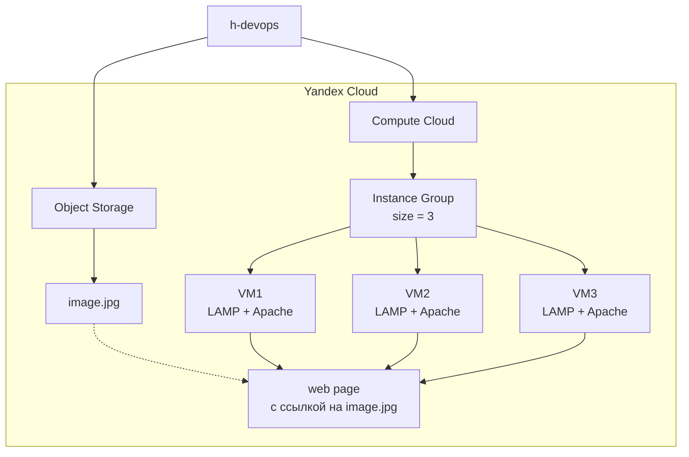
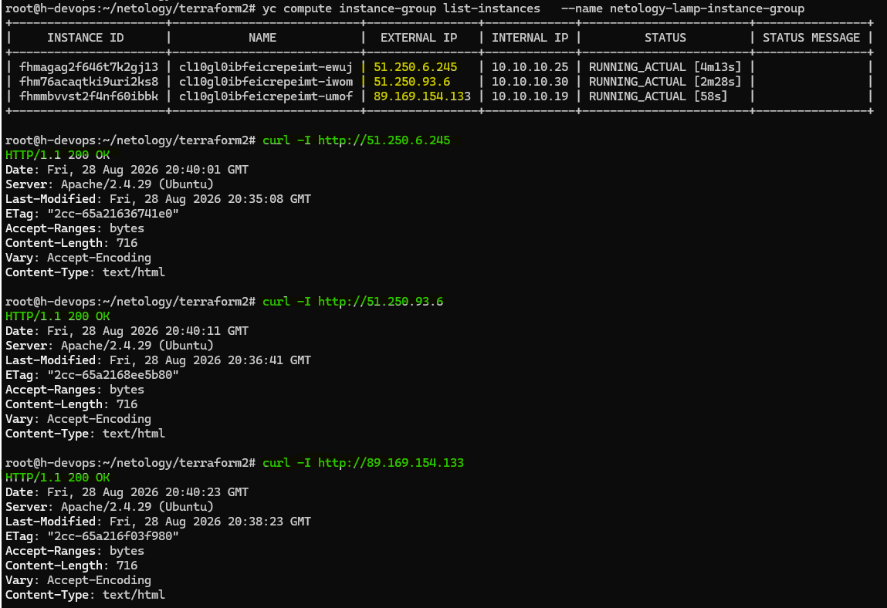
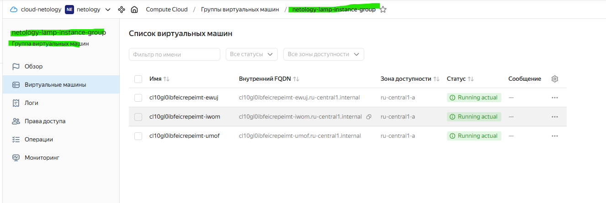
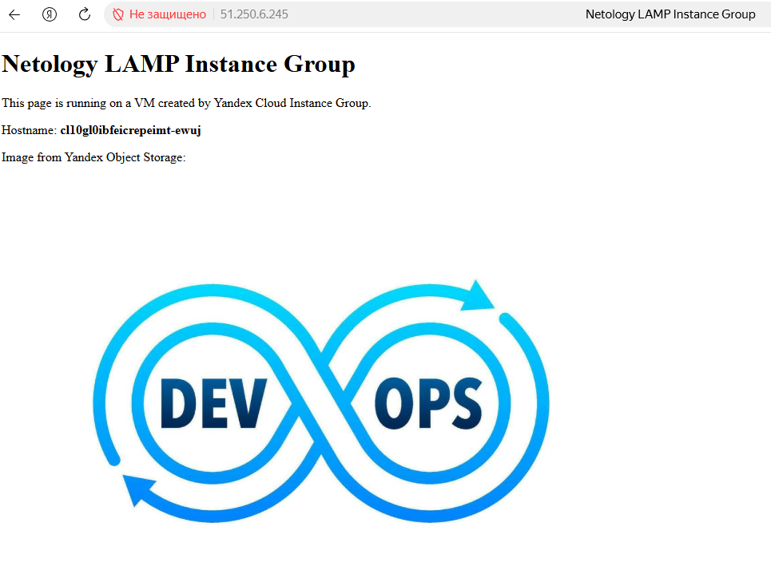
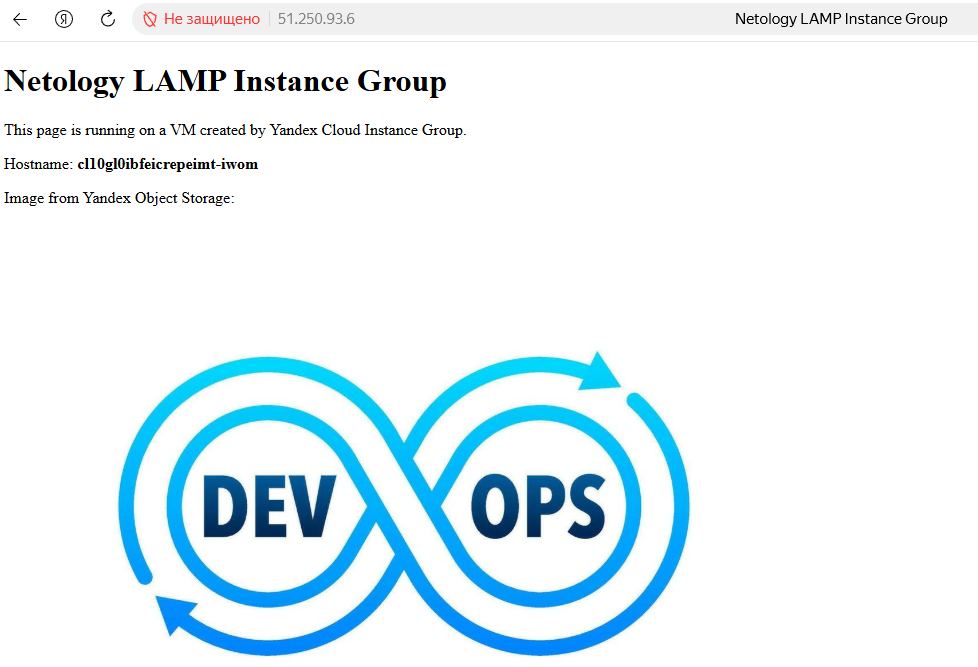
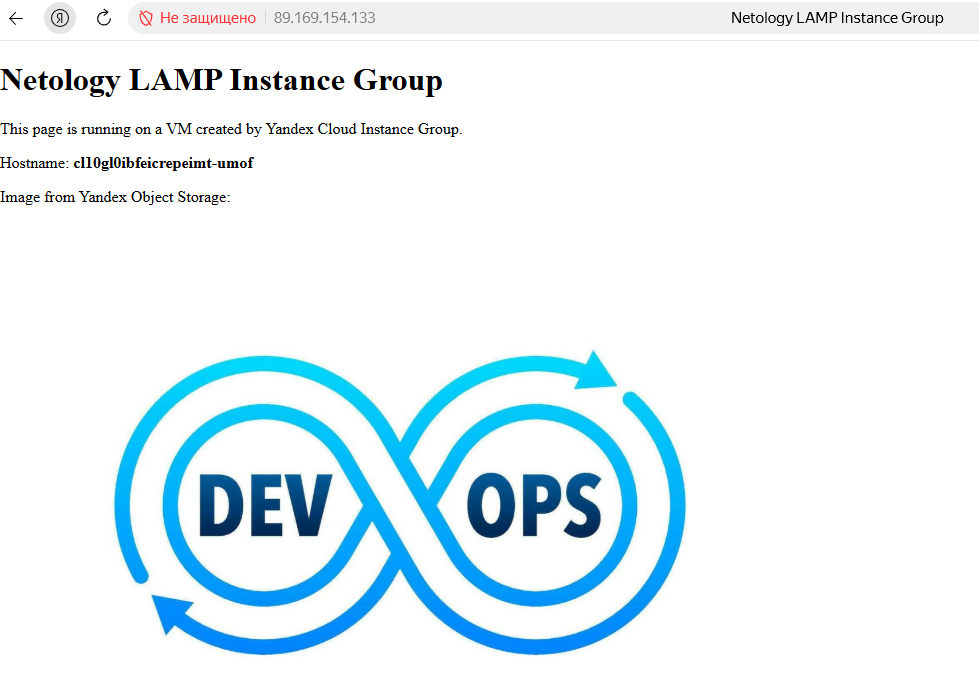
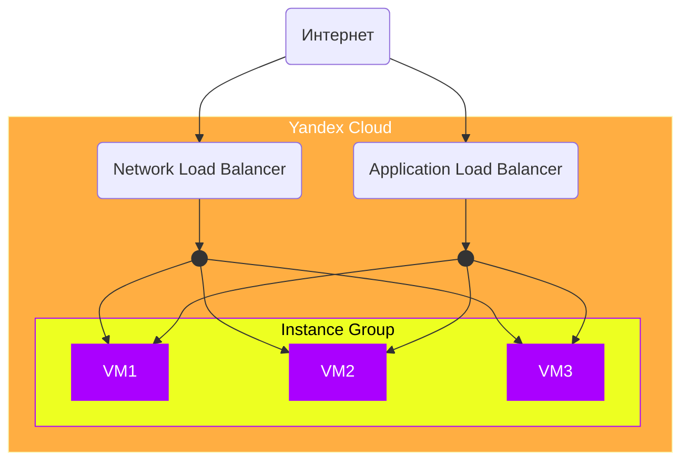

# Домашнее задание к занятию «Вычислительные мощности. Балансировщики нагрузки»  

### Подготовка к выполнению задания

1. Домашнее задание состоит из обязательной части, которую нужно выполнить на провайдере Yandex Cloud, и дополнительной части в AWS (выполняется по желанию). 
2. Все домашние задания в блоке 15 связаны друг с другом и в конце представляют пример законченной инфраструктуры.  
3. Все задания нужно выполнить с помощью Terraform. Результатом выполненного домашнего задания будет код в репозитории. 
4. Перед началом работы настройте доступ к облачным ресурсам из Terraform, используя материалы прошлых лекций и домашних заданий.

---
## Задание 1. Yandex Cloud 

**Что нужно сделать**

1. Создать бакет Object Storage и разместить в нём файл с картинкой:

 - Создать бакет в Object Storage с произвольным именем (например, _имя_студента_дата_).
 - Положить в бакет файл с картинкой.
 - Сделать файл доступным из интернета.
 
2. Создать группу ВМ в public подсети фиксированного размера с шаблоном LAMP и веб-страницей, содержащей ссылку на картинку из бакета:

 - Создать Instance Group с тремя ВМ и шаблоном LAMP. Для LAMP рекомендуется использовать `image_id = fd827b91d99psvq5fjit`.
 - Для создания стартовой веб-страницы рекомендуется использовать раздел `user_data` в [meta_data](https://cloud.yandex.ru/docs/compute/concepts/vm-metadata).
 - Разместить в стартовой веб-странице шаблонной ВМ ссылку на картинку из бакета.
 - Настроить проверку состояния ВМ.
 
3. Подключить группу к сетевому балансировщику:

 - Создать сетевой балансировщик.
 - Проверить работоспособность, удалив одну или несколько ВМ.
4. (дополнительно)* Создать Application Load Balancer с использованием Instance group и проверкой состояния.

Полезные документы:

- [Compute instance group](https://registry.terraform.io/providers/yandex-cloud/yandex/latest/docs/resources/compute_instance_group).
- [Network Load Balancer](https://registry.terraform.io/providers/yandex-cloud/yandex/latest/docs/resources/lb_network_load_balancer).
- [Группа ВМ с сетевым балансировщиком](https://cloud.yandex.ru/docs/compute/operations/instance-groups/create-with-balancer).

## Решение

### 1. Создаем бакет Object Storage и размещаем в нём файл с картинкой

#### IAM-ключ service account

У нас уже есть файл с кредами к аккаунту:

```bash
~/.authorized_key.json
```
Нас интересует:

`service_account_id`

Получить его можно:

```bash
grep service_account_id ~/.authorized_key.json
```


#### Получаем Static Access Key

Теперь используем тот же service account:

```bash
yc iam access-key list \
  --service-account-id aje......vh
  ```


Здесь очень важно различать три значения.

##### ID

Например:

`aje........k8`

Это ID объекта access key в IAM.

##### SERVICE ACCOUNT ID

Например:

aje........vh

Это ID service account.

##### KEY ID

Например:

YCAJxxxxxxxxxxxxZi

Вот это является Access Key ID для S3.

Именно его мы используем в:

`YC_STORAGE_ACCESS_KEY`

#### Где взять Secret Access Key

Команда:

`yc iam access-key list`

*Secret* не показывает.

Если secret для существующего ключа не сохранён, создаём новый:

yc iam access-key create \
  --service-account-id aje........vh

Результат будет такой:


Получаем пару:

Access Key ID:
YCAJxxxxxxxxxxxxZi

Secret Access Key:
YCMxxxxxxxxxxxxxxxxxxxxxxkv

`Secret` показывается только при создании.

#### Экспортируем ключи

Для Yandex Terraform provider используем:

export YC_STORAGE_ACCESS_KEY="YCAJxxxxxxxxxxxZi"
export YC_STORAGE_SECRET_KEY="YCMxxxxxxxxxxxxxxxxxxxxxxkv"

Проверить можно безопасно:

```bash
printf 'ACCESS: %s...%s\n' \
  "${YC_STORAGE_ACCESS_KEY:0:4}" \
  "${YC_STORAGE_ACCESS_KEY: -2}"
  ```


```bash
printf 'ACCESS: %s...%s\n' \
  "${YC_STORAGE_SECRET_KEY:0:4}" \
  "${YC_STORAGE_SECRET_KEY: -2}"
  ```


#### Выдать права

```bash
yc resource-manager folder add-access-binding \
  <FOLDER_ID> \
  --role storage.editor \
  --subject serviceAccount:<SERVICE_ACCOUNT_ID>
```


Выполняем проект терраформ

```bash
terraform init
terraform plan
terraform apply
```


Ссылка на скачивание файла
`https://storage.yandexcloud.net/netology-ivanov-sergey-20260828/image.jpg`

### 2. Создаем группу ВМ в public подсети фиксированного размера с шаблоном LAMP и веб-страницей, содержащей ссылку на картинку из бакета

### Схема



#### Нам потребуется:

1. сеть и public subnet — если они уже есть, используем существующие;
2. Instance Group;
3. Instance Template;
4.образ LAMP:
    `fd827b91d99psvq5fjit`
5. user_data для создания стартовой страницы;
6. Load Balancer для Instance Group — желательно сразу сделать правильно, поскольку нам требуется проверка состояния ВМ;
7. health check;
8. три экземпляра ВМ.

#### Добавляем права для netology-instance-group-sa

Проверяем, что у `netology-instance-group-sa` нет прав


Добавляем права `compute.editor` для `netology-instance-group-sa`


Добавляем права `vpc.user` для `netology-instance-group-sa`


 
Добавляем права `resource-manager.viewer` для `netology-instance-group-sa`


Проверяем:






### LAMP 1



### LAMP 2



### LAMP 3




## 3-4 Подключить группу к сетевому балансировщику и создать Application Load Balancer с использованием Instance group и проверкой состояния.

### Схема


---
## Задание 2*. AWS (задание со звёздочкой)

Это необязательное задание. Его выполнение не влияет на получение зачёта по домашней работе.

**Что нужно сделать**

Используя конфигурации, выполненные в домашнем задании из предыдущего занятия, добавить к Production like сети Autoscaling group из трёх EC2-инстансов с  автоматической установкой веб-сервера в private домен.

1. Создать бакет S3 и разместить в нём файл с картинкой:

 - Создать бакет в S3 с произвольным именем (например, _имя_студента_дата_).
 - Положить в бакет файл с картинкой.
 - Сделать доступным из интернета.
2. Сделать Launch configurations с использованием bootstrap-скрипта с созданием веб-страницы, на которой будет ссылка на картинку в S3. 
3. Загрузить три ЕС2-инстанса и настроить LB с помощью Autoscaling Group.

Resource Terraform:

- [S3 bucket](https://registry.terraform.io/providers/hashicorp/aws/latest/docs/resources/s3_bucket)
- [Launch Template](https://registry.terraform.io/providers/hashicorp/aws/latest/docs/resources/launch_template).
- [Autoscaling group](https://registry.terraform.io/providers/hashicorp/aws/latest/docs/resources/autoscaling_group).
- [Launch configuration](https://registry.terraform.io/providers/hashicorp/aws/latest/docs/resources/launch_configuration).

Пример bootstrap-скрипта:

```
#!/bin/bash
yum install httpd -y
service httpd start
chkconfig httpd on
cd /var/www/html
echo "<html><h1>My cool web-server</h1></html>" > index.html
```
### Правила приёма работы

Домашняя работа оформляется в своём Git репозитории в файле README.md. Выполненное домашнее задание пришлите ссылкой на .md-файл в вашем репозитории.
Файл README.md должен содержать скриншоты вывода необходимых команд, а также скриншоты результатов.
Репозиторий должен содержать тексты манифестов или ссылки на них в файле README.md.