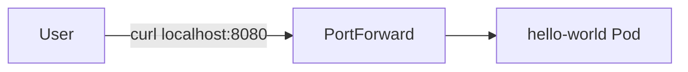
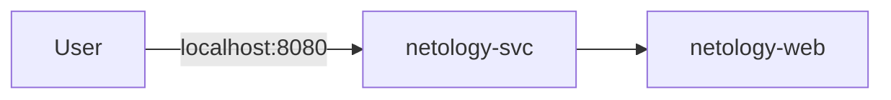

# netology
Репозиторий выполнения домашних заданий по курсу DevOps
# Домашнее задание к занятию «Базовые объекты K8S»

### Цель задания

В тестовой среде для работы с Kubernetes, установленной в предыдущем ДЗ, необходимо развернуть Pod с приложением и подключиться к нему со своего локального компьютера. 

------

### Чеклист готовности к домашнему заданию

1. Установленное k8s-решение (например, MicroK8S).
2. Установленный локальный kubectl.
3. Редактор YAML-файлов с подключенным Git-репозиторием.

------

### Инструменты и дополнительные материалы, которые пригодятся для выполнения задания

1. Описание [Pod](https://kubernetes.io/docs/concepts/workloads/pods/) и примеры манифестов.
2. Описание [Service](https://kubernetes.io/docs/concepts/services-networking/service/).

------

### Задание 1. Создать Pod с именем hello-world

1. Создать манифест (yaml-конфигурацию) Pod.
2. Использовать image - gcr.io/kubernetes-e2e-test-images/echoserver:2.2.
3. Подключиться локально к Pod с помощью `kubectl port-forward` и вывести значение (curl или в браузере).

# Решение

### Цель
Создать Pod и проверить его работу через `kubectl port-forward`.

---

## 1. Манифест Pod

Создаём файл `hello-world-pod.yaml`:

```yaml id="pod1"
apiVersion: v1
kind: Pod
metadata:
  name: hello-world
  labels:
    app: hello-world
spec:
  containers:
    - name: echoserver
      image: gcr.io/kubernetes-e2e-test-images/echoserver:2.2
      ports:
        - containerPort: 8080
```

---

## 2. Применение манифеста

```bash id="apply1"
kubectl apply -f hello-world-pod.yaml
```

Проверка:

```bash id="get1"
kubectl get pods
```


---

## 3. Port Forward

Для проброса порта:

```bash id="pf1"
kubectl port-forward pod/hello-world 8080:8080
```

---

## 4. Проверка работы

В новом терминале:

```bash id="curl1"
curl http://localhost:8080
```

---

## Схема работы



---

## Итог

Создан Pod `hello-world` с образом `echoserver`, доступ к которому осуществляется локально через `kubectl port-forward`.

------

### Задание 2. Создать Service и подключить его к Pod

1. Создать Pod с именем netology-web.
2. Использовать image — gcr.io/kubernetes-e2e-test-images/echoserver:2.2.
3. Создать Service с именем netology-svc и подключить к netology-web.
4. Подключиться локально к Service с помощью `kubectl port-forward` и вывести значение (curl или в браузере).

# Решение

### 1. Создание Pod `netology-web`

```yaml id="pod1"
apiVersion: v1
kind: Pod
metadata:
  name: netology-web
  labels:
    app: netology-web
spec:
  containers:
    - name: echoserver
      image: gcr.io/kubernetes-e2e-test-images/echoserver:2.2
      ports:
        - containerPort: 8080
```

---

### 2. Создание Service `netology-svc`

Service типа ClusterIP, который будет маршрутизировать трафик на Pod `netology-web`.

```yaml id="svc2"
apiVersion: v1
kind: Service
metadata:
  name: netology-svc
spec:
  selector:
    app: netology-web
  ports:
    - protocol: TCP
      port: 80
      targetPort: 8080
```

---

### 3. Применение манифестов

```bash id="apply1"
kubectl apply -f pod.yaml
kubectl apply -f service.yaml
```

---

### 4. Проверка ресурсов

```bash id="check1"
kubectl get pods
kubectl get svc
```

---

### 5. Подключение через port-forward

```bash id="pf1"
kubectl port-forward service/netology-svc 8080:80
```

---

### 6. Проверка через curl

```bash id="curl1"
curl http://localhost:8080
```


---

### 8. Схема взаимодействия



---

### Итог

- создан Pod `netology-web`
- создан Service `netology-svc`
- Service связан с Pod через selector `app: netology-web`
- доступ к приложению получен через `kubectl port-forward`

------

### Правила приёма работы

1. Домашняя работа оформляется в своем Git-репозитории в файле README.md. Выполненное домашнее задание пришлите ссылкой на .md-файл в вашем репозитории.
2. Файл README.md должен содержать скриншоты вывода команд `kubectl get pods`, а также скриншот результата подключения.
3. Репозиторий должен содержать файлы манифестов и ссылки на них в файле README.md.

------

### Критерии оценки
Зачёт — выполнены все задания, ответы даны в развернутой форме, приложены соответствующие скриншоты и файлы проекта, в выполненных заданиях нет противоречий и нарушения логики.

На доработку — задание выполнено частично или не выполнено, в логике выполнения заданий есть противоречия, существенные недостатки.