# Домашнее задание к занятию "`Защита хоста`" - `Иванов Сергей`

## ✅  Задание 1

1. Установите **eCryptfs**.
2. Добавьте пользователя **cryptouser**.
3. Зашифруйте домашний каталог пользователя с помощью **eCryptfs**.

*В качестве ответа пришлите снимки экрана домашнего каталога пользователя с исходными и зашифрованными данными.*

### Ответ:

Устанавливаем **eCryptfs**

```bash
apt update
apt install ecryptfs-utils
```

Добавляем пользователя 

```bash
adduser cryptouser
```

Запускаем утилиту  на шифрование домашнеого каталога cryptouser

```bash
ecryptfs-migrate-home -u cryptouser
```

Заходим в домашний каталог от имени пользователя cryptouser

```bash
su cryptouser
```

Созаем тестовый файл

```bash
touch 123,456
```

Каталог пользователя **cryptouser* с исходными фалами/данными

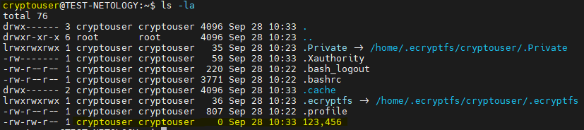


Останавливаем монтирование  зашифрованной домашней директории пользователя cryptouser

```bash
ecryptfs-umount-private
```

выходим из сессии пользвателя **cryptouser* 

```bash
exit
```

Каталог пользователя **cryptouser* с исходными фалами/данными. Просмотр от пользователя root.

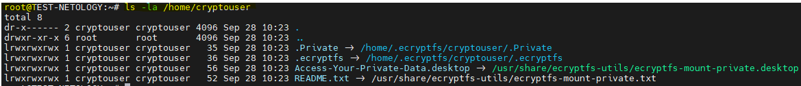

Созданные пользователем cryptouser файлы исчезли из домашней директории пользователя и теперь находятся в зашифрованном виде

```bash
ls -la /home/.ecryptfs/cryptouser/.Private
```
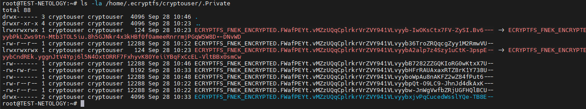


## ✅ Задание 2

1. Установите поддержку LUKS.
2. Создайте небольшой раздел, например, 100 Мб.
3. Зашифруйте созданный раздел с помощью LUKS.

*В качестве ответа пришлите снимки экрана с поэтапным выполнением задания.*

### Ответ:

#### Устанавливаем

```bash
apt install cryptsetup
```

#### Проверяем установленную версию:

```bash
cryptsetup --version
```

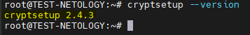

#### Создаем диск 1G на виртуальной машине

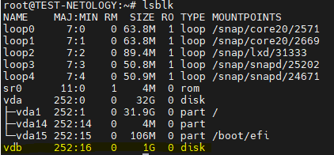

#### Утилитой fdisk создаем раздел 100M

```bash
fdisk /dev/vdb
```

Далее выполняем:
  * n — создать новый раздел.
  * p — primary.
  * Номер раздела: 1.
  * Первый сектор — оставьте по умолчанию (Enter).
  * Последний сектор — введите +100M (чтобы сделать раздел на 100 МБ).
  * w — записать изменения.

#### Проверяем диск и разделы

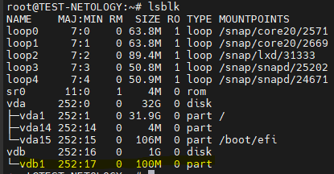

#### Создаём LUKS на разделе

`Используем ввод пароля из stdin, так как интерактивный ввод не работает в cloud-окружении.`

```bash
echo -n "<пароль>" | cryptsetup luksFormat /dev/vdb1 -
```
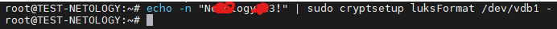

`PS: Мы под root. Можно sudo не использовать`

#### Открываем зашифрованный раздел

```bash
echo -n "<пароль>" | cryptsetup luksOpen /dev/vdb1 luks_vdb1 -
```

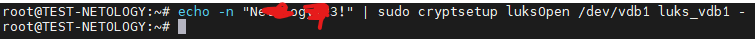

`PS: Мы под root. Можно sudo не использовать`

Проверим:

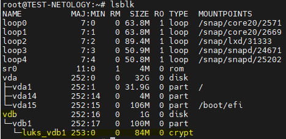

#### Создаём файловую систему ext4

```bash
mkfs.ext4 /dev/mapper/luks_vdb1
```

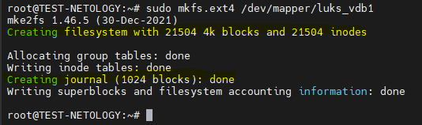

`PS: Мы под root. Можно sudo не использовать`

#### Монтируем раздел

```bash
mkdir /mnt/luks_vdb1
mount /dev/mapper/luks_vdb1 /mnt/luks_vdb1
ls -la /mnt/luks_vdb1
```
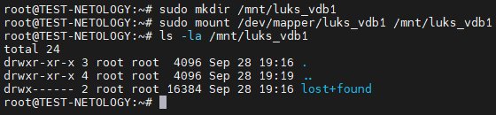

`PS: Мы под root. Можно sudo не использовать`

#### Создаём тестовый файл

```bash
echo "Hello LUKS" | tee /mnt/luks_vdb1/test.txt
ls -la /mnt/luks_vdb1
```
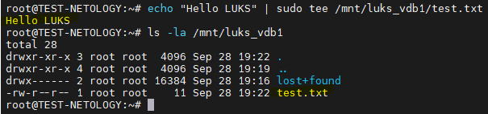

`PS: Мы под root. Можно sudo не использовать`

#### Размонтируем и закрываем

```bash
umount /mnt/luks_vdb1
cryptsetup luksClose luks_vdb1
lsblk
```
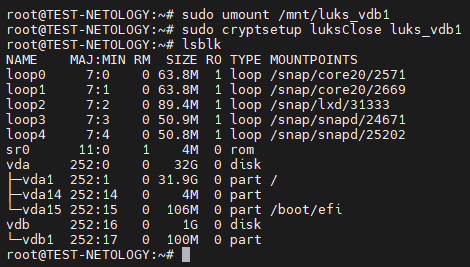

`PS: Мы под root. Можно sudo не использовать`

Вывод:
  * Раздел /dev/vdc1 зашифрован через LUKS.
  * Создана файловая система ext4.
  * Проверено монтирование и работа с файлами.
  * После luksClose доступ к данным возможен только после повторного ввода пароля.

## Дополнительные задания (со звёздочкой*)
Эти задания дополнительные, то есть не обязательные к выполнению, и никак не повлияют на получение вами зачёта по этому домашнему заданию. Вы можете их выполнить, если хотите глубже шире разобраться в материале

## ✅  Задание 3*

1. Установите **apparmor**.
2. Повторите эксперимент, указанный в лекции.
3. Отключите (удалите) apparmor.

*В качестве ответа пришлите снимки экрана с поэтапным выполнением задания.*

### Ответ:

### 1. Устанавливаем Apparmor

```bash
apt install apparmor-profiles apparmor-utils apparmor-profiles-extra
```
Посмотрим статус:

```bash
apparmor_status
```
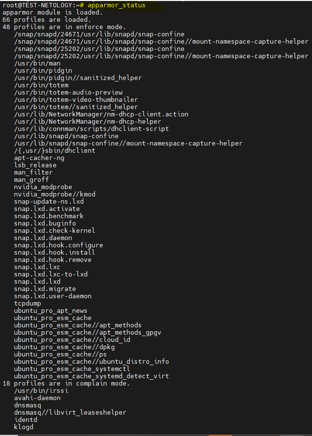

#### Проводим эксперемент из лекции с ping

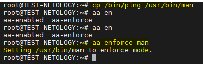

#### В режиме man

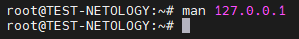

  * без AppArmor это вызвало бы ping 127.0.0.1,
  * но с AppArmor — запуск блокируется.

#### В режиме complain

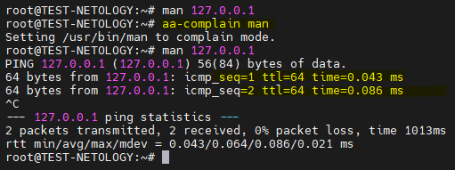

#### Отключение AppArmor

```bash
apt remove --purge apparmor apparmor-utils -y
reboot
```