# Курс "DevOps-инженер с нуля" (FOPS-36)
18 ноября 2024 — 8 июля 2026

## 1. Модуль "IT-системы и операционная система Linux" (SLINA-45)
20 ноября — 5 декабря

* Администрирование IT-систем
* Архитектура компьютера. Операционная система
* Настройка виртуального рабочего места
* Типы дистрибутивов
* Знакомство с операционной системой Linux
* Основы работы в терминалe ОС Linux

<a href="img/SLINA-45.png">
  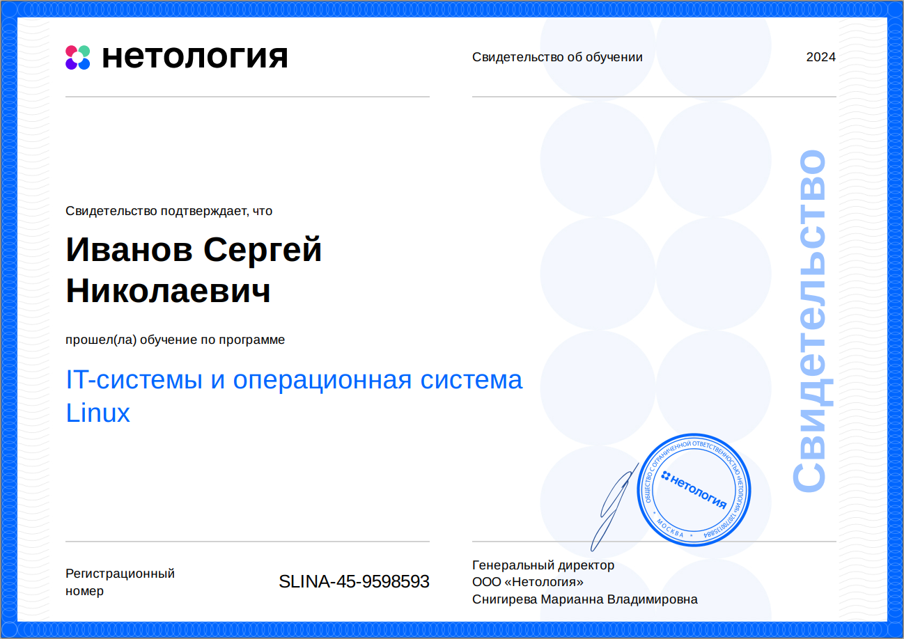
</a>

## 2. Модуль "Операционная система Linux" (SLINB-45)
20 ноября — 5 декабря

* Процессы, управление процессами
* Память, управление памятью
* Шедулер
* Дисковые системы
* Файловые системы
* Ядро операционной системы
* Загрузка операционной системы

<a href="img/SLINB-45.png">
  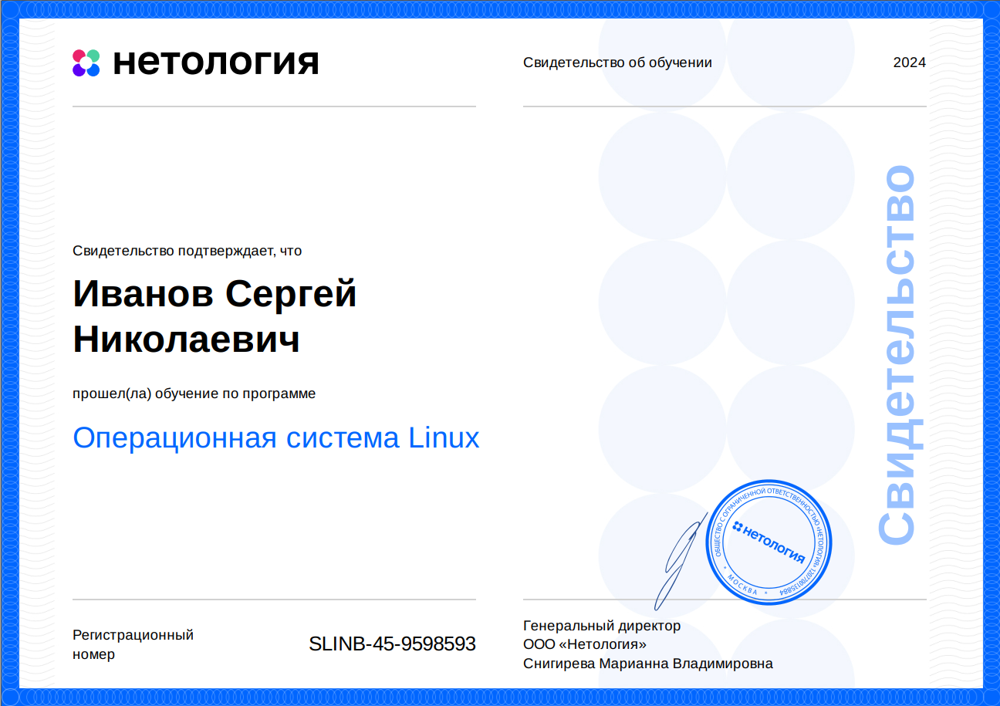
</a>

## 3. Модуль "Администрирование операционной системы Linux" (SLINC-45)
16 января — 30 января

* Управление пакетами
* Инициализация системы. Systemd, init-v
* Управление пользователями
* Производительность системы
* Производительность системы. Часть 2
* Особенности работы с Astra Linux

<a href="img/SLINC-45.png">
  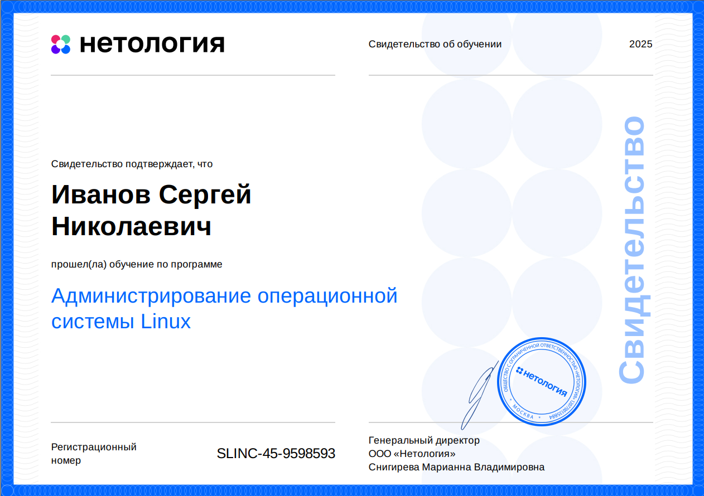
</a>

## 4. Модуль "Программирование на Bash" (BASH-45)
4 февраля — 22 февраля

* Организационная информация модуля «Программирование на Bash»
* Переменные и условные операторы
* Циклы и функции
* Regexp и его использование для синтаксического анализа
* Работа с текстовыми утилитами
* Разбор скриптов и их написание
* Сбор вопросов к разборному вебинару
* Разборный вебинар по всем темам «Программирование на Bash»

<a href="img/BASH-45.png">
  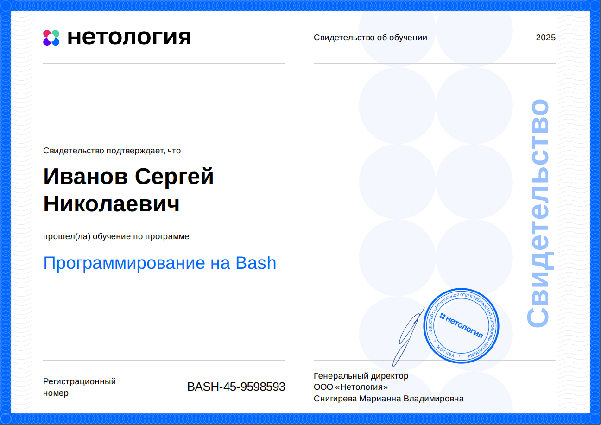
</a>

## 5. Модуль "Сеть, сетевые протоколы" (NET-45)
24 февраля — 10 марта

* Организационная информация
* Теоретические основы сети
* Сеть и сетевые протоколы: L2-сеть
* Сеть и сетевые протоколы: L3-сеть
* Сеть и сетевые протоколы: L4-сеть
* NAT
* IPv6

<a href="img/NET-45.png">
  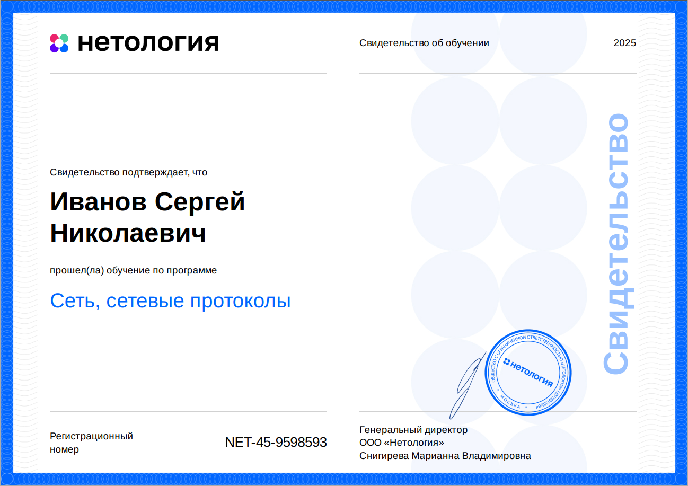
</a>

## 6. Модуль "Виртуализация" (SVIRT-44)
24 марта — 14 апреля

* Виртуализация и облачные решения. AWS, GCP, Яндекс.Облако, Openstack
* Типы виртуализаций KVM, QEMU
* Docker
* Docker. Часть 2
* Kubernetes
* Kubernetes. Часть 2
* 

<a href="img/SVIRT-44.png">
  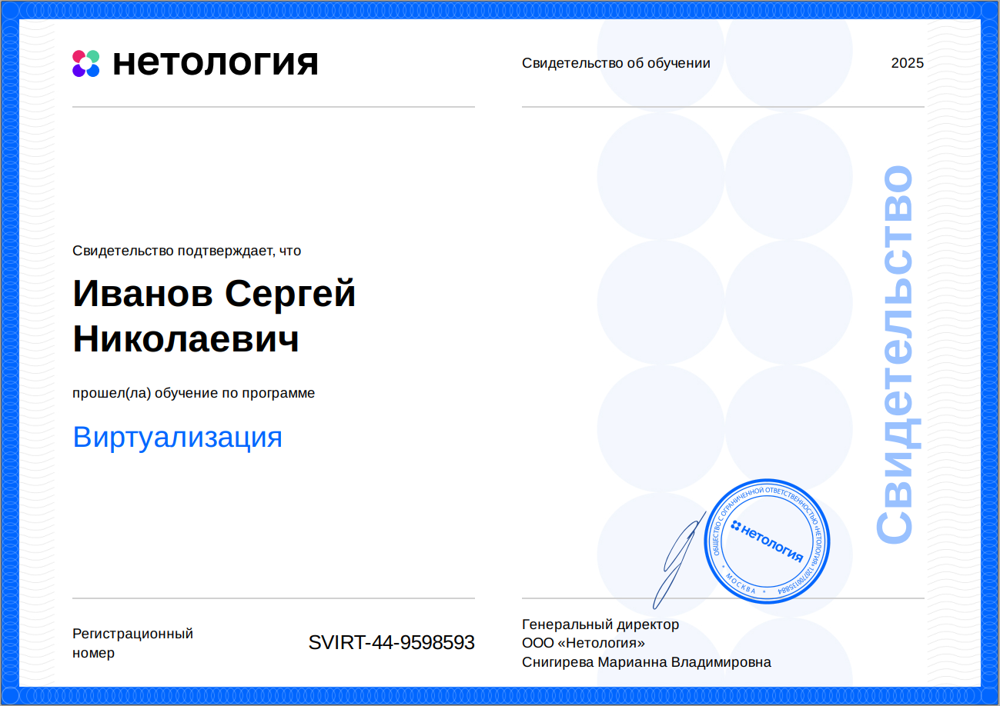
</a>

## 7. Модуль "Автоматизация и CI/СD" (CICD-44)
17 апреля — 15 мая

* Ansible
* Ansible. Часть 2
* Terraform
* Подъем инфраструктуры в облаке
* Git
* Что такое DevOps. CI/CD
* GitLab

<a href="img/CICD-44.png">
  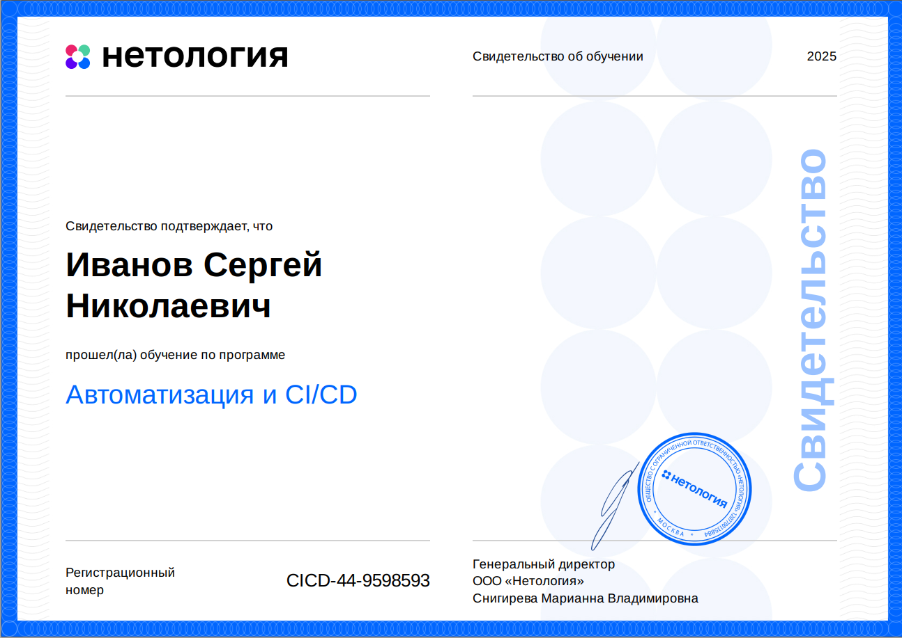
</a>

## 8. Модуль "Мониторинг" (SMON-44)
19 мая — 5 июня

* Обзор систем ИТ-мониторинга
* Система мониторинга Zabbix
* Система мониторинга Zabbix. Часть 2
* Подготовка к практикуму по работе с Zabbix
* Практикум по работе с Zabbix
* Система мониторинга Prometheus
* Система мониторинга Prometheus. Часть 2

<a href="img/SMON-44.png">
  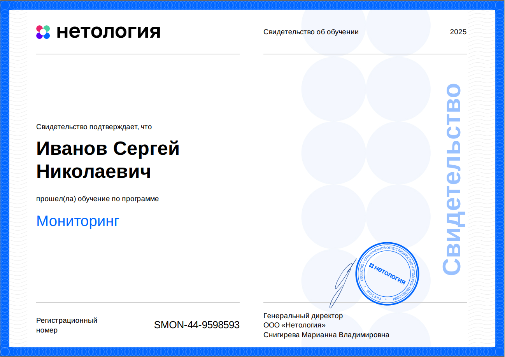
</a>

## 9. Модуль "Отказоустойчивость" (SFLT-44)
7 июня — 1 июля

* Disaster Recovery. FHRP и Keepalived
* Кластеризация и балансировка нагрузки
* Резервное копирование
* Отказоустойчивость в облаке

<a href="img/SFLT-44.png">
  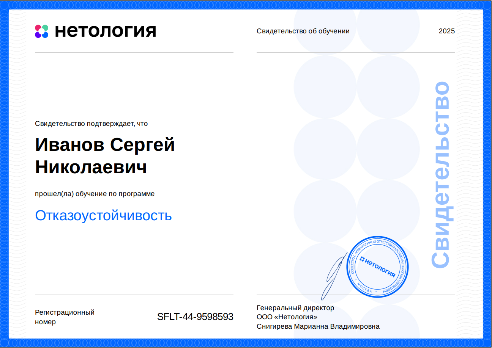
</a>

## 10. Модуль "Системы хранения и передачи данных" (SYSDB-44)
10 июля — 24 июля

* Базы данных, их типы
* Кеширование Redis/memcached
* ELK
* Очереди RabbitMQ

<a href="img/SYSDB-44.png">
  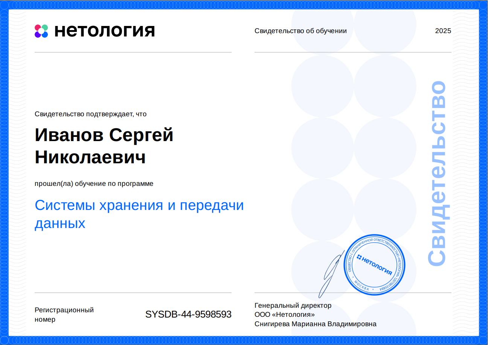
</a>

## 11. Модуль "Реляционные базы данных и администрирование баз данных" (SDBSQL-44)
28 июля — 29 августа

* Базы данных
* Введение в SQL
* Операции с данными в SQL
* Расширенные возможности SQL
* Индексы
* Репликация и масштабирование. Часть 1
* Репликация и масштабирование. Часть 2
* Резервное копирование.
* Базы данных в облаке

<a href="img/SDBSQL-44.png">
  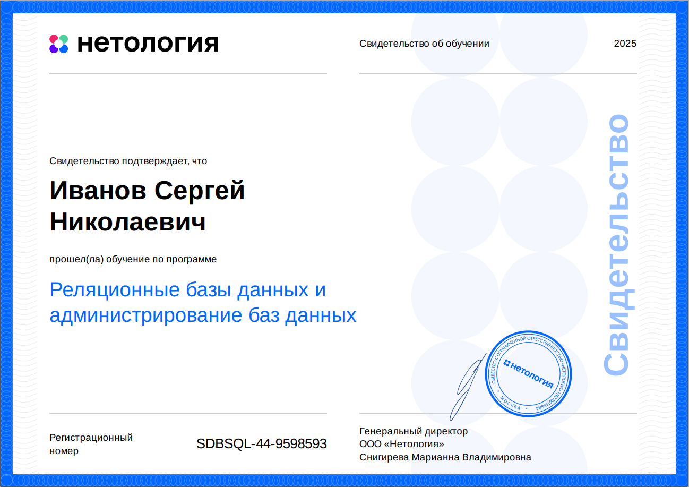
</a>

## 12. Модуль "Информационная безопасность" (SYSSEC-44)
2 сентября — 17 сентября

* Уязвимости и атаки на информационные системы
* Защита хоста
* Защита сети
* Лучшие практики современной информационной безопасности

<a href="img/SYSSEC-44.png">
  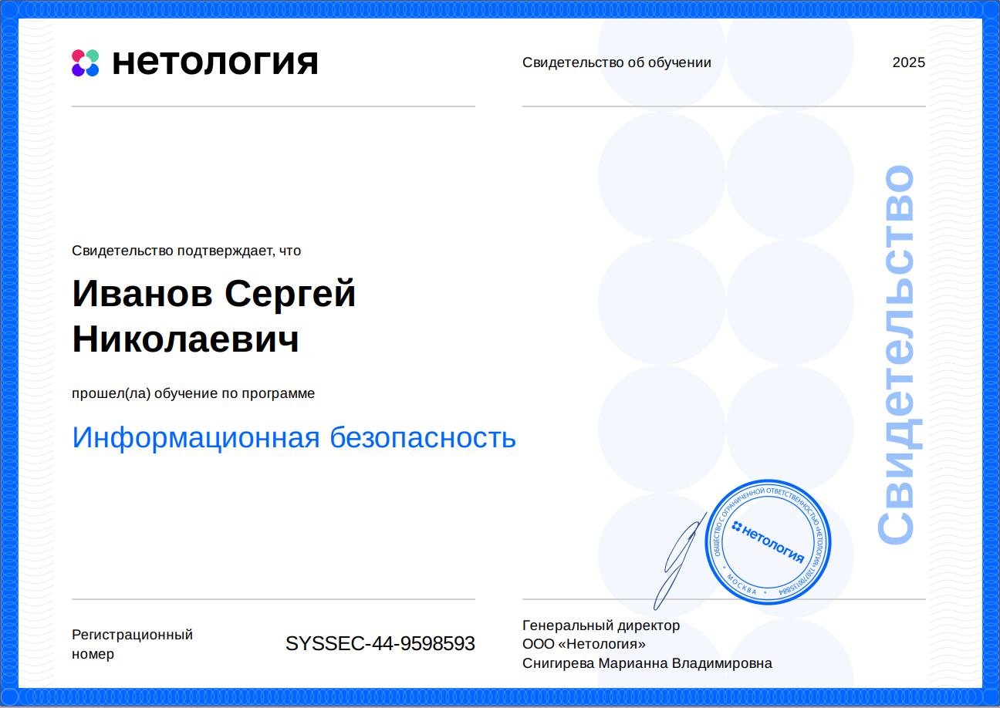
</a>

## 13. Модуль "Системы управления версиями" (GIT-FOPS-35)
15 октября — 29 октября

* Системы контроля версий
* Основы Git
* Ветвления в Git
* Инструменты Git

<a href="img/GIT-FOPS-35.png">
  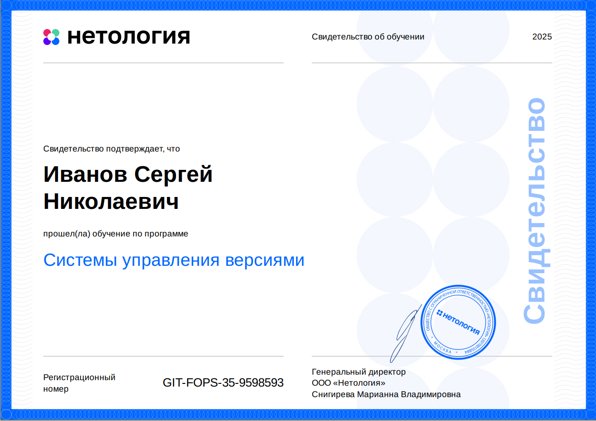
</a>

## 14. Модуль "Виртуализация и контейнеризация" (SHVIRTD-25)
5 ноября — 16 ноября

* Введение в курс
* Введение в виртуализацию. Типы и функции гипервизоров. Обзор рынка вендоров и областей применения
* Применение принципов IaaC в работе с виртуальными машинами
* Введение в Docker
* Оркестрация группой Docker контейнеров на примере Docker Compose.
* Практическое применение Docker. Часть 1
* Практическое применение Docker. Часть 2
* Оркестрация кластером Docker контейнеров на примере Docker Swarm.

<a href="img/SHVIRTD-25.png">
  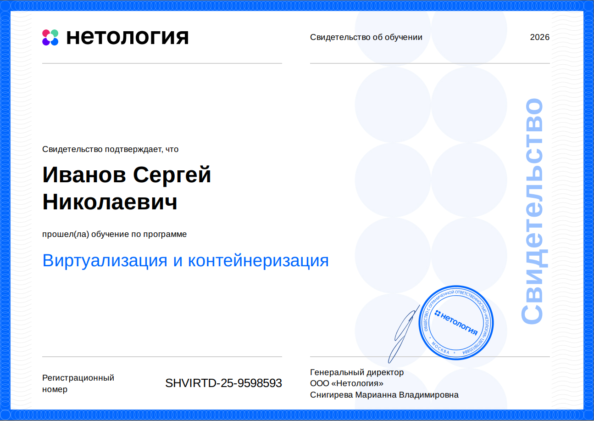
</a>

## 15. Модуль "Облачная инфраструктура. Terraform" (SHTER-25)
19 ноября — 2 декабря

* Введение в Terraform
* Основы работы с Terraform
* Управляющие конструкции в коде Terraform
* Продвинутые методы работы с Terraform
* Использование Terraform в команде
* Итоговый проект модуля «Облачная инфраструктура. Terraform»

- Домашнее задание "Основы работы с Terraform"
- Домашнее задание "Продвинутые методы работы с Terraform"

<a href="img/SHTER-25.png">
  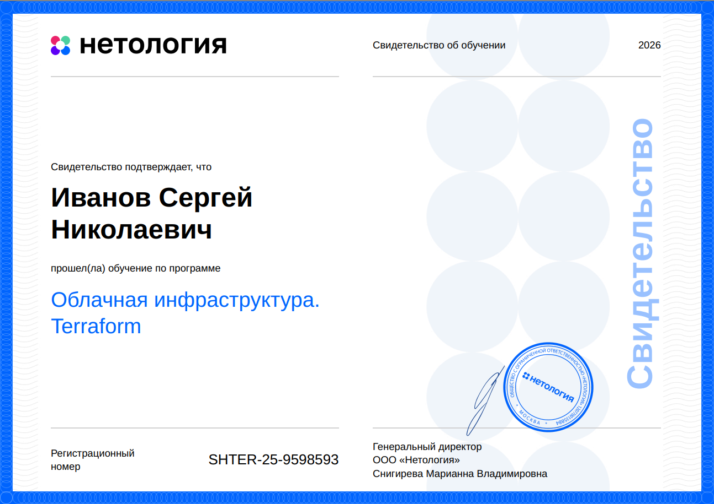
</a>

## 16. Модуль "Система управления конфигурациями" (SHKONF-25)
15 декабря — 12 января

* Введение в Ansible
* Работа с Playbook
* Использование Ansible
* Работа с roles
* Тестирование roles
* Создание собственных модулей

- Домашнее задание "Работа с roles"
- Домашнее задание "Тестирование roles"
- Домашнее задание "Создание собственных модулей"

<a href="img/SHKONF-25.png">
  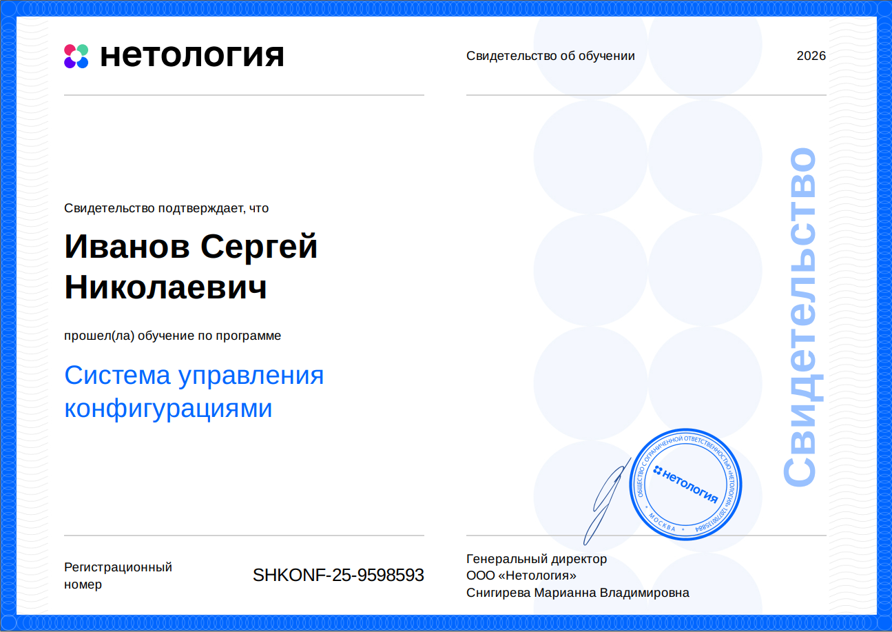
</a>

## 17. Модуль "Непрерывная разработка и интеграция" (SHCICD-DEV-25)
13 января — 29 января

* Жизненный цикл ПО
* DevOps и SRE
* Процессы CI/CD
* Jenkins
* Teamcity
* Gitlab

- [Практическое задание "Жизненный цикл ПО"](https://github.com/radiomost/netology/blob/SHCICD-DEV-25/life_programm/README.md)
- Тест к занятию «DevOps и SRE»
- [Домашнее задание "Teamcity"](https://github.com/radiomost/netology/blob/SHCICD-DEV-25/teamcity/README.md)

<a href="img/SHCICD-DEV-25.png">
  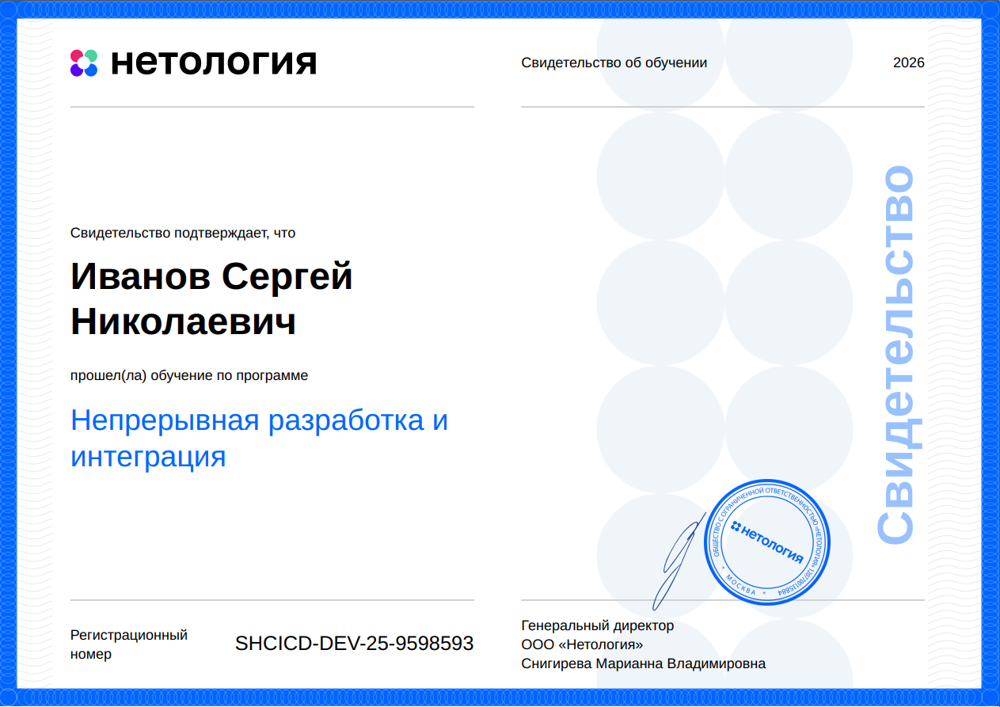
</a>

## 18. Модуль "Мониторинг и логи" (SHMON-DEV-25)
_______________

* Системы мониторинга
* Средство визуализации Grafana
* Система сбора логов Elastic Stack
* Платформа мониторинга Sentry
* Инцидент-менеджмент

- [Домашнее задание "Системы мониторинга"](https://github.com/radiomost/netology/blob/SHMON-DEV-25/monitoring_system/README.md)
- [Домашнее задание "Средство визуализации Grafana"](https://github.com/radiomost/netology/blob/SHMON-DEV-25/grafana_visualization/README.md)
- [Домашнее задание "Система сбора логов Elastic Stack"](https://github.com/radiomost/netology/blob/SHMON-DEV-25/elastic_search/README.md)

<a href="img/SHMON-DEV-25.png">
  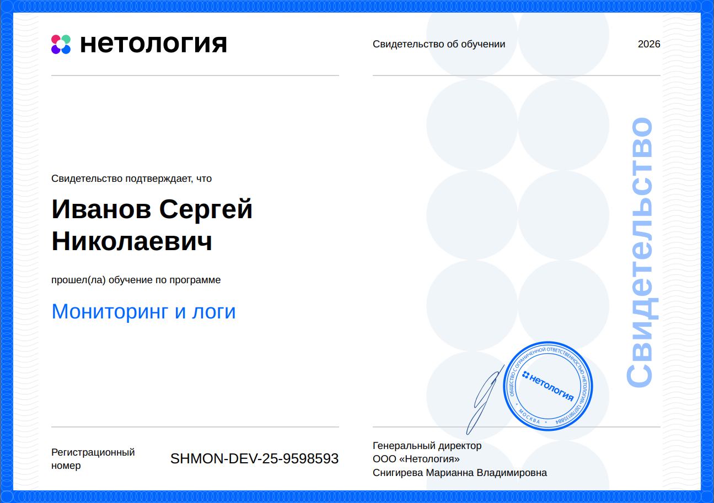
</a>

## 19. Модуль "Микросервисы" (SHMICROS-25)
24 февраля — 10 марта

* Введение в микросервисы
* Микросервисы: принципы
* Микросервисы: подходы
* Микросервисы: масштабирование

- [Домашнее задание "Микросервисы: подходы"](https://github.com/radiomost/netology/blob/SHMICROS-25/microservices_approaches/README.md)
- [Домашнее задание "Микросервисы: масштабирование"](https://github.com/radiomost/netology/blob/SHMICROS-25/microservices_caling/README.md)

<a href="img/SHMICROS-25.png">
  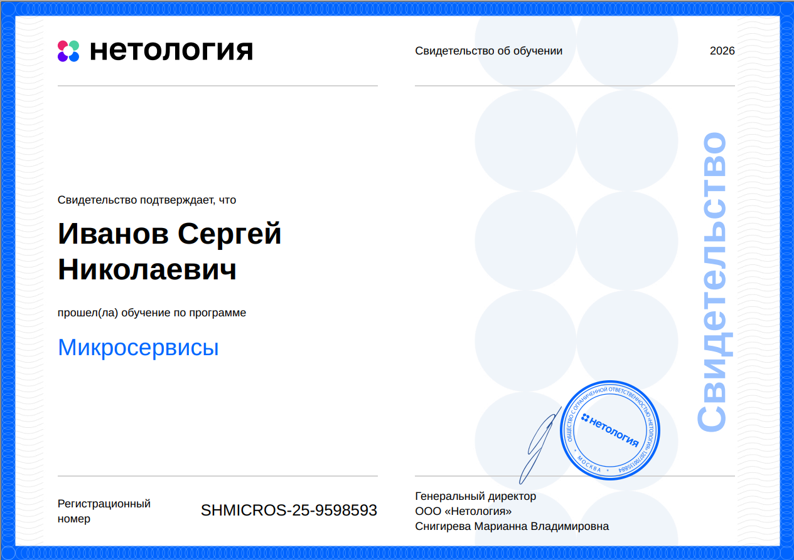
</a>

## 20. Модуль "Kubernetes: основы, применение и администрирование" (SHKUBER-25)
16 марта — 20 апреля

* Kubernetes. Причины появления. Команда kubectl
* Базовые объекты K8S
* Запуск приложений в K8S
* Сетевое взаимодействие в Kubernetes
* Хранение в K8s
* Настройка приложений
* Helm
* Компоненты Kubernetes
* Установка Kubernetes с помощью kubeadm, kubespray
* Как работает сеть в K8S
* Обновление приложений
* Troubleshooting

- [Домашнее задание к занятию «Базовые объекты K8S»](https://github.com/radiomost/netology/blob/SHKUBER-25/k8s_base_objects/README.md)

## 21. Модуль "Организация проекта при помощи облачных провайдеров" (SHCLOPRO-25)
4 мая — 19 мая

* Организация сети
* Вычислительные мощности. Балансировщики нагрузки
* Безопасность в облачных провайдерах
* Кластеры. Ресурсы под управлением облачным провайдером

## 22. Модуль "Митапы для DevOps-разработчиков и системных администраторов" (MITAP-FOPS-1)

* Курс на успех: ваша образовательная стратегия
* Митап «Основы Apache Airflow»
* Деплоймент и архитектура распределенного приложения на Bare Metal Kubernetes
* Обзорная экскурсия по базам данных и файловым хранилищам
* Митап «Безопасные интеграции 1С: что должен знать аналитик»
* Как стать амбассадором Нетологии
* RAG-системы на практике
* Обратная связь и постановка границ, с которыми не спорят
