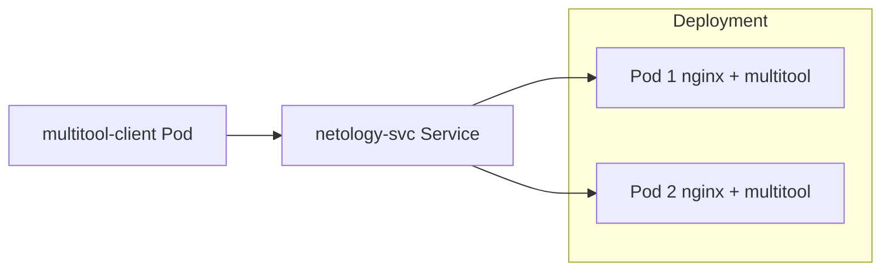
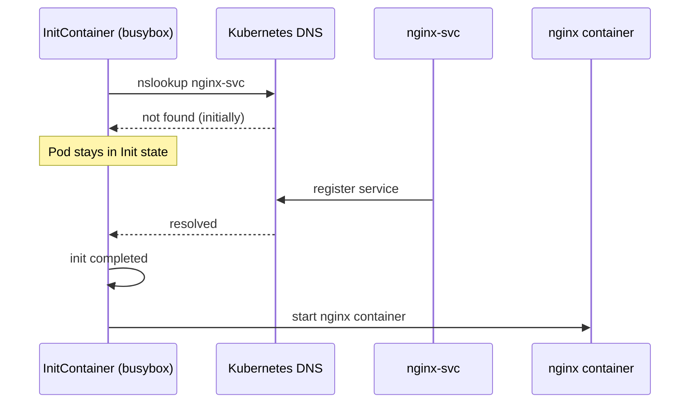

# Домашнее задание к занятию «Запуск приложений в K8S»

### Цель задания

В тестовой среде для работы с Kubernetes, установленной в предыдущем ДЗ, необходимо развернуть Deployment с приложением, состоящим из нескольких контейнеров, и масштабировать его.

------

### Чеклист готовности к домашнему заданию

1. Установленное k8s-решение (например, MicroK8S).
2. Установленный локальный kubectl.
3. Редактор YAML-файлов с подключённым git-репозиторием.

------

### Инструменты и дополнительные материалы, которые пригодятся для выполнения задания

1. [Описание](https://kubernetes.io/docs/concepts/workloads/controllers/deployment/) Deployment и примеры манифестов.
2. [Описание](https://kubernetes.io/docs/concepts/workloads/pods/init-containers/) Init-контейнеров.
3. [Описание](https://github.com/wbitt/Network-MultiTool) Multitool.

------

### Задание 1. Создать Deployment и обеспечить доступ к репликам приложения из другого Pod

1. Создать Deployment приложения, состоящего из двух контейнеров — nginx и multitool. Решить возникшую ошибку.
2. После запуска увеличить количество реплик работающего приложения до 2.
3. Продемонстрировать количество подов до и после масштабирования.
4. Создать Service, который обеспечит доступ до реплик приложений из п.1.
5. Создать отдельный Pod с приложением multitool и убедиться с помощью `curl`, что из пода есть доступ до приложений из п.1.

# Решение

### Важный момент (ошибка)

Если просто добавить два контейнера без команд — `multitool` может завершаться или конфликтовать по портам/процессу.

#### Решение:
- nginx работает как web-сервер
- multitool работает как "sidecar" и не должен завершаться

---

### Deployment манифест

```yaml id="dep1"
apiVersion: apps/v1
kind: Deployment
metadata:
  name: netology-app
spec:
  replicas: 1
  selector:
    matchLabels:
      app: netology-app
  template:
    metadata:
      labels:
        app: netology-app
    spec:
      containers:
        - name: nginx
          image: nginx:1.25
          ports:
            - containerPort: 80

        - name: multitool
          image: praqma/network-multitool
          command: ["sh", "-c", "while true; do sleep 3600; done"]
```

---

## 2. Применение Deployment

```bash id="apply1"
kubectl apply -f deployment.yaml
```

---

## 3. Проверка Pod’ов (до масштабирования)

```bash id="get1"
kubectl get pods
```


---

## 4. Масштабирование Deployment до 2 реплик

```bash id="scale1"
kubectl scale deployment netology-app --replicas=2
```

---

## 5. Проверка Pod’ов (после масштабирования)

```bash id="get2"
kubectl get pods
```


---

## 6. Создание Service

Service обеспечивает доступ к nginx внутри кластера.

```yaml id="svc1"
apiVersion: v1
kind: Service
metadata:
  name: netology-svc
spec:
  selector:
    app: netology-app
  ports:
    - protocol: TCP
      port: 80
      targetPort: 80
  type: ClusterIP
```

---

## 7. Применение Service

```bash id="apply2"
kubectl apply -f service.yaml
```

---

## 8. Создание отдельного Pod (multitool)

```yaml id="pod1"
apiVersion: v1
kind: Pod
metadata:
  name: multitool-client
spec:
  containers:
    - name: multitool
      image: praqma/network-multitool
      command: ["sh", "-c", "sleep 3600"]
```

```bash id="apply3"
kubectl apply -f multitool.yaml
```

---

## 9. Проверка доступа через curl

Заходим в Pod:

```bash id="exec1"
kubectl exec -it multitool-client -- sh
```

Внутри Pod выполняем:

```bash id="curl1"
curl http://netology-svc
```

---

## 10. Ожидаемый результат


---

## 11. Схема архитектуры



---

## Итог

- создан Deployment с 2 контейнерами (nginx + multitool)
- исправлена проблема долгоживущего multitool (sleep loop)
- выполнено масштабирование до 2 реплик
- создан Service для балансировки
- подтверждена доступность через отдельный Pod

------

### Задание 2. Создать Deployment и обеспечить старт основного контейнера при выполнении условий

1. Создать Deployment приложения nginx и обеспечить старт контейнера только после того, как будет запущен сервис этого приложения.
2. Убедиться, что nginx не стартует. В качестве Init-контейнера взять busybox.
3. Создать и запустить Service. Убедиться, что Init запустился.
4. Продемонстрировать состояние пода до и после запуска сервиса.

# Решение

---

# Цель

Обеспечить запуск основного контейнера `nginx` **только после появления Service**.

Для этого используем:
- `initContainer (busybox)` как "блокирующую проверку"
- ожидание доступности Service DNS

---

# 1. Идея решения

InitContainer будет:
- проверять DNS имя Service
- ждать пока оно станет доступно

```text id="flow0"
until nslookup nginx-svc; do sleep 2; done
```

---

# 2. Deployment с initContainer

```yaml id="dep1"
apiVersion: apps/v1
kind: Deployment
metadata:
  name: nginx-delayed
spec:
  replicas: 1
  selector:
    matchLabels:
      app: nginx-delayed
  template:
    metadata:
      labels:
        app: nginx-delayed
    spec:
      initContainers:
        - name: wait-for-endpoints
          image: busybox:1.36
          command:
            - sh
            - -c
            - |
              echo "Waiting for endpoints..."
              until nslookup nginx-svc && wget -qO- http://nginx-svc; do
                echo "not ready"
                sleep 2
              done

      containers:
        - name: nginx
          image: nginx:1.25
          ports:
            - containerPort: 80
```

---

# 3. Состояние ДО запуска Service

После создания Deployment:

```bash id="apply1"
kubectl apply -f deployment_2.yaml
kubectl get pods
```


nginx НЕ запускается, потому что initContainer ждёт DNS Service

---

# 4. Создание Service

```yaml id="svc1"
apiVersion: v1
kind: Service
metadata:
  name: nginx-svc
spec:
  selector:
    app: nginx-delayed
  ports:
    - port: 80
      targetPort: 80
```

---

```bash id="apply2"
kubectl apply -f service_2.yaml
```

---

# 5. Состояние ПОСЛЕ создания Service

```bash id="get2"
kubectl get pods
```

Ожидаемо:

```text id="state2"
nginx-delayed-xxx   1/1   Running
```

---

# 6. Проверка initContainer

```bash id="logs1"
kubectl logs nginx-delayed-xxx -c wait-for-service
```

Ожидаемый вывод:

```text id="log1"
Waiting for service nginx-svc...
Service not ready
Service is available
```

---

# 7. Проверка Service

```bash id="svc2"
kubectl get svc
```

```text id="svc3"
nginx-svc   ClusterIP   10.x.x.x
```

---

# 8. Схема работы



---

# 9. Итог

- nginx не стартует до появления Service
- initContainer блокирует запуск Pod
- после создания Service происходит резолв DNS
- init завершается → стартует nginx
- продемонстрирована зависимость через Kubernetes DNS

------

### Правила приема работы

1. Домашняя работа оформляется в своем Git-репозитории в файле README.md. Выполненное домашнее задание пришлите ссылкой на .md-файл в вашем репозитории.
2. Файл README.md должен содержать скриншоты вывода необходимых команд `kubectl` и скриншоты результатов.
3. Репозиторий должен содержать файлы манифестов и ссылки на них в файле README.md.

------