# Иванов Сергей. Дипломный практикум в Yandex.Cloud

* [1. Создание облачной инфраструктуры:](#)
  * [1.1 Настройка Terraform (backend в S3 или Terraform Cloud)](#11-настройка-terraform-backend-в-s3-или-terraform-cloud).
    * [Шаг 1.1.1: Выбор Backend](#шаг-111-выбор-backend)
    * [Шаг 1.1.2: Инициализация структуры проекта](#шаг-112-инициализация-структуры-проекта)
    * [Шаг 1.1.3: Настройка провайдера](#шаг-113-настройка-провайдера)

  * [1.2 Создание сервисного аккаунта с необходимыми правами](#12-создание-сервисного-аккаунта-с-необходимыми-правами)
    * [Шаг 1.2.1: Создание SA (Service Account)](#шаг-121-создание-sa-service-account)
    * [Шаг 1.2.2: Назначение ролей](#шаг-122-назначение-ролей)
    * [Шаг 1.2.3: Создание статического ключа доступа](#шаг-123-создание-статического-ключа-доступа)

  * [1.3 Развертывание сети (VPC, подсети в разных зонах доступности)](#13-развертывание-сети-vpc-подсети-в-разных-зонах-доступности)
    * [Шаг 1.3.1: Создание VPC](#шаг-131-создание-vpc)
    * [Шаг 1.3.2: Создание подсетей](#шаг-132-создание-подсетей)
    * [Шаг 1.3.3: Настройка маршрутизации (опционально для начала, но важно для K8s)](#шаг-133-настройка-маршрутизации-опционально-для-начала-но-важно-для-k8s)

  * [1.4 Обеспечение возможности полного управления инфраструктурой через terraform apply и terraform destroy](#14-обеспечение-возможности-полного-управления-инфраструктурой-через-terraform-apply-и-terraform-destroy)
    * [Шаг 1.4.1: Проверка зависимостей](#шаг-141-проверка-зависимостей)
    * [Шаг 1.4.2: Тестирование жизненного цикла](#шаг-142-тестирование-жизненного-цикла)
    * [Шаг 1.4.3: Настройка Backend для основного конфига](#шаг-143-настройка-backend-для-основного-конфига)

* [2. Создание Kubernetes кластера](#2-создание-kubernetes-кластера)
  * [2.1 Самостоятельная установка K8s на VM (через Terraform + Ansible/Kubespray)](#21-самостоятельная-установка-k8s-на-vm-через-terraform--ansiblekubespray)
    * [Шаг 2.1.1: Создание вычислительных ресурсов (Terraform)](#шаг-211-создание-вычислительных-ресурсов-terraform)
    * [Шаг 2.1.2: Настройка Ansible и подготовка inventory](#шаг-212-настройка-ansible-и-подготовка-inventory)

  * [2.2 Проверка работоспособности кластера (kubectl get pods)](#22-проверка-работоспособности-кластера-kubectl-get-pods)

* [3. Создание тестового приложения](#3-создание-тестового-приложения)
  * [3.1 Создание git-репозитория с простым приложением (например, nginx со статикой)](#31-создание-git-репозитория-с-простым-приложением-например-nginx-со-статикой)
    * [Шаг 3.1.1: ](#)
    * [Шаг 3.1.2: ](#)
    * [Шаг 3.1.3: ](#)
* [4. Подготовка системы мониторинга и деплой приложения](#4-подготовка-системы-мониторинга-и-деплой-приложения)
  * [4.1 Установка стека мониторинга: Prometheus, Grafana, Alertmanager, Node Exporter (через kube-prometheus или Helm)](#41-установка-стека-мониторинга-prometheus-grafana-alertmanager-node-exporter-через-kube-prometheus-или-helm)
    * [Шаг 4.1.1: ](#)
    * [Шаг 4.1.2: ](#)
    * [Шаг 4.1.3: ](#)
  * [4.2 Деплой тестового приложения в кластер](#42-деплой-тестового-приложения-в-кластер)
    * [Шаг 4.2.1: ](#)
    * [Шаг 4.2.2: ](#)
    * [Шаг 4.2.3: ](#)
  * [4.3 Настройка доступа к Grafana и приложению по HTTP (порт 80)](#43-настройка-доступа-к-grafana-и-приложению-по-http-порт-80)
    * [Шаг 4.3.1: ](#)
    * [Шаг 4.3.2: ](#)
    * [Шаг 4.3.3: ](#)
  * [4.4 Настройка CI/CD для инфраструктуры (Atlantis, Terraform Cloud или пайплайн в CI-системе)](#44-настройка-cicd-для-инфраструктуры-atlantis-terraform-cloud-или-пайплайн-в-ci-системе)
    * [Шаг 4.4.1: ](#)
    * [Шаг 4.4.2: ](#)
    * [Шаг 4.4.3: ](#)
* [5. Установка и настройка CI/CD](#5-установка-и-настройка-cicd)
  * [5.1 Настройка автоматической сборки Docker-образа при коммите в репозиторий приложения](#51-настройка-автоматической-сборки-docker-образа-при-коммите-в-репозиторий-приложения)
    * [Шаг 5.1.1: ](#)
    * [Шаг 5.1.2: ](#)
    * [Шаг 5.1.3: ](#)  
  * [5.2 Настройка автоматического деплоя нового образа в Kubernetes при создании тега (например, v1.0.0)](#52-настройка-автоматического-деплоя-нового-образа-в-kubernetes-при-создании-тега-например-v100)
    * [Шаг 5.2.1: ](#)
    * [Шаг 5.2.2: ](#)
    * [Шаг 5.2.3: ](#)
  * [5.3 Использование Jenkins, GitLab CI, TeamCity или GitHub Actions](#53-использование-jenkins-gitlab-ci-teamcity-или-github-actions)
    * [Шаг 5.3.1: ](#)
    * [Шаг 5.3.2: ](#)
    * [Шаг 5.3.3: ](#)

## 1 Создание облачной инфраструктуры

#### Шаг 1.1.1: Выбор Backend


#### Шаг 1.1.2: Инициализация структуры проекта
#### Шаг 1.1.3: Настройка провайдера

### 1.2 Создание сервисного аккаунта с необходимыми правами

Для безопасной автоматизации Terraform не должен использовать персональные токены с правами суперпользователя. Вместо этого создается выделенный сервисный аккаунт (Service Account, SA) с принципом наименьших привилегий (Principle of Least Privilege). 

Конфигурация для этого этапа изолирована в папке `stage0-bootstrap`, что соответствует требованию диплома хранить конфигурации bootstrap-ресурсов и основной инфраструктуры в разных директориях.

#### Шаг 1.2.1: Создание SA (Service Account)

Создается сервисный аккаунт, который будет использоваться для управления ресурсами.
[stage0-bootstrap](stage0-bootstrap/main.tf).

**Результат:** В консоли Yandex Cloud (раздел Service Accounts) создан аккаунт 'diplom-project-bootstrap-sa'.

#### Шаг 1.2.2: Назначение ролей

Сервисному аккаунту назначается роль storage.admin на уровне папки. Этого достаточно для создания и управления S3-бакетами (включая backend), но запрещает несанкционированное изменение других ресурсов облака.
[stage0-bootstrap](stage0-bootstrap/main.tf)

**Результат:** В разделе Access bindings этого аккаунта или на уровне Folder подтверждена роль storage.admin.

#### Шаг 1.2.3: Создание статического ключа доступа

Для аутентификации Terraform в S3-совместимом хранилище (backend) необходимы статические ключи (Access Key и Secret Key), привязанные к сервисному аккаунту.
[stage0-bootstrap](stage0-bootstrap/main.tf)

**Результат:** Сгенерированы ключи, которые выводятся в консоль как sensitive переменные (static_access_key и static_secret_key).
Эти ключи будут использованы в конфигурации provider.tf для основной инфраструктуры (stage1-infra), а также для настройки профиля minio-truenas в локальном окружении или CI/CD.

**Безопасность:** Статические ключи никогда не коммитятся в Git. Они передаются через переменные окружения или защищенные хранилища секретов (Secret Manager).

### 1.3 Развертывание сети (VPC, подсети в разных зонах доступности)

Для обеспечения отказоустойчивости будущего Kubernetes-кластера и соответствия best practices, сетевая инфраструктура разворачивается в нескольких зонах доступности. Конфигурация 
вынесена в отдельную директорию `stage1-network/`, чтобы отделить её от bootstrap-ресурсов, как того требует задание.
[stage1-network](stage1-network/main.tf)

#### Шаг 1.3.1: Создание VPC

Создается базовая виртуальная сеть (VPC), которая объединит все ресурсы проекта.

```hcl
resource "yandex_vpc_network" "k8s_network" {
  name        = "${var.project_name}-vpc"
  description = "VPC network for K8s infrastructure"
}
```

#### Шаг 1.3.2: Создание подсетей

Для регионального кластера необходимо минимум две зоны доступности. Создаем подсети в зонах ru-central1-a и ru-central1-b с непересекающимися CIDR-блоками.
[stage1-network](stage1-network/main.tf)

#### Шаг 1.3.3: Настройка маршрутизации (опционально для начала, но важно для K8s)

В Yandex Cloud по умолчанию маршрутизация внутри VPC работает автоматически: ресурсы в разных подсетях одной сети видят друг друга без дополнительных настроек.
Для доступа нод K8s в Интернет (например, для скачивания образов контейнеров) обычно используют NAT Gateway. Однако, для строгой экономии бюджета купона, мы откажемся от создания платного NAT Gateway. Вместо этого, на следующем этапе (создание ВМ), мы будем назначать публичные IP-адреса непосредственно на сетевые интерфейсы виртуальных машин. Это полностью закрывает потребность в исходящем и входящем интернете без дополнительных затрат на сетевое оборудование.

#### Конфигурация бэкенда для stage1:
Чтобы Terraform использовал единое хранилище состояний, в stage1-network/provider.tf настроен тот же S3 backend, что и в stage0, но с уникальным ключом:
```hcl
backend "s3" {
  bucket = "netology"
  key    = "stage1-network.tfstate" # Уникальный ключ для сетевой инфраструктуры
  # ... остальные настройки s3-api.rdmost.ru
}
```

### 1.4 Обеспечение возможности полного управления инфраструктурой через terraform apply и terraform destroy

Инфраструктура должна создаваться и удаляться одной командой без ручных правок в консоли. Это гарантирует воспроизводимость и возможность быстрого восстановления окружения.
Для автоматизированного управления проектами инфраструктуры, был разработан [Makefile](/root/netology/Makefile) и команды для централизованного управления.

```bash
# Инициализация всех проектов
make init

# Проверка всех проектов
make plan

# Сборка всех проектов
make apply

# Удаление всех проектов
make destroy
```

#### Шаг 1.4.1: Проверка зависимостей

Перед тестированием жизненного цикла необходимо убедиться, что все ресурсы правильно связаны между собой и Terraform корректно понимает порядок их создания/удаления.

**Проверка графа зависимостей:**
```bash
cd stage1-network
terraform graph | dot -Tpng > dependency-graph.png
```
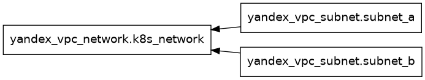

#### Шаг 1.4.2: Тестирование жизненного цикла

Выполняем полный цикл создания и удаления инфраструктуры для проверки автоматизации.

```bash
# Проверяем, что state хранится в S3
terraform state list
```

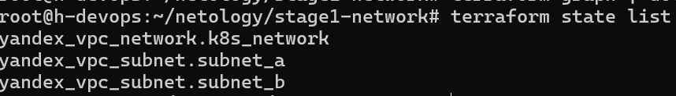

```bash
# Удаляем всю инфраструктуру
terraform destroy -auto-approve

# Снова создаем инфраструктуру
terraform apply -auto-approve
```

#### Шаг 1.4.3: Настройка Backend для основного конфига

Скриншот, показывающий, что файл stage1-network.tfstate существует в S3 bucket.
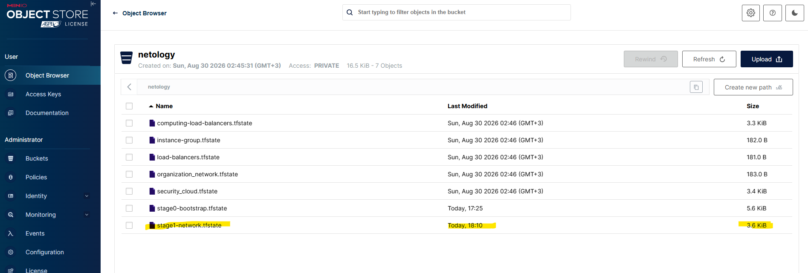

### Преимущества использования S3 backend:
**Централизованное хранение:** State доступен всем участникам команды
**Версионирование:** Можно отслеживать изменения инфраструктуры во времени
**Блокировки:** Предотвращение одновременного изменения инфраструктуры несколькими пользователями
**Безопасность:** 'State' не хранится на локальных машинах

  ✅ Итоговая проверка

### После выполнения всех тестов инфраструктура должна:

  ✅ Создаваться командой 'terraform apply' без ручных действий

  ✅ Удаляться командой 'terraform destroy' без ручных действий

  ✅ Воспроизводиться с идентичными параметрами

  ✅ Хранить state в S3 backend

  ✅ Корректно управлять зависимостями между ресурсами

## 2. Создание Kubernetes кластера
### 2.1 Самостоятельная установка K8s на VM (через Terraform + Ansible/Kubespray).

Самостоятельная установка Kubernetes (Self-hosted) через Terraform и Kubespray — это классический и наиболее ценный для DevOps-инженера подход. Он позволяет полностью контролировать инфраструктуру и глубже понимать внутреннее устройство кластера.
Для выполнения этого этапа мы создадим новую директорию stage2-compute/, где с помощью Terraform развернем 3 виртуальные машины (1 Master и 2 Worker), а затем используем Ansible и Kubespray для установки Kubernetes.

#### Шаг 2.1.1: Создание вычислительных ресурсов (Terraform)

С помощью Terraform создается 3 виртуальные машины в разных зонах доступности (`ru-central1-a` и `ru-central1-b`). 

**Замечание** Так как с высокой вероятностью автоматически назначенные внешние IP адреса виртуальным машинам РКН блокирует, то я в ручном режиме создал публичные IP адреса и проверил их (через отдельную VM), что они не заблокированы РКН. Эти статические IP адреса я внес в переменные проекта [terraform.tfvars](stage2-compute/terraform.tfvars)

**Оптимизация бюджета:**
- **Master node:** 2 vCPU, 4 GB RAM, `preemptible = false`. Мастер критичен для работы кластера, поэтому он не должен прерываться.
- **Worker nodes:** 2 vCPU, 4 GB RAM, `preemptible = true`. Использование прерываемых ВМ для воркеров позволяет существенно экономить бюджет купона.
- **Сеть:** Всем ВМ назначаются публичные IP-адреса (`nat = true`) для обеспечения доступа из Интернета и возможности скачивания Docker-образов.

**Файл:** [stage2-compute/main.tf](stage2-compute/main.tf)

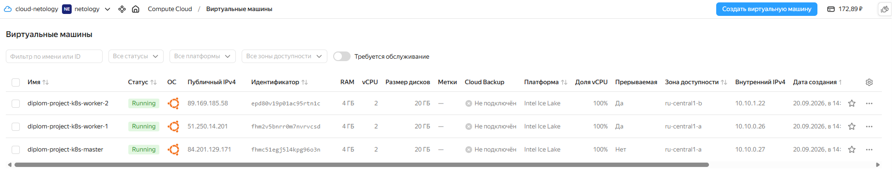

#### Шаг 2.1.2: Настройка Ansible и подготовка inventory

После успешного создания виртуальных машин через Terraform (`terraform apply` в папке `stage2-compute`), необходимо подготовить Ansible inventory для Kubespray. Этот процесс полностью автоматизирован через Makefile и bash-скрипты, что исключает ручные операции и ошибки.

### Автоматизация через Makefile

Для управления процессом развертывания Kubernetes кластера используется система целей (targets) в Makefile, расположенном в корне проекта. Это обеспечивает воспроизводимость и упрощает процесс для других участников команды.


```mermaid
treeView-beta
netology/ # Основной Makefile с целями автоматизации
  Makefile
  scripts/
    setup-kubespray.sh # Bash-скрипт для настройки Kubespray
  stage2-compute/ # Terraform конфигурация ВМ
  kubespray/ # Клонируется автоматически при выполнении make kubespray-init
``` 

### Инициализация Kubespray

Первым шагом является клонирование репозитория Kubespray и настройка Python-окружения для работы с Ansible.
```bash
make kubespray-init
```

**Что делает команда `make kubespray-init`:**

1. **Проверка окружения:** Скрипт проверяет наличие необходимых директорий (`stage2-compute`) и инструментов (`pyenv`, `git`).

2. **Клонирование Kubespray:** Если директория `kubespray` не существует, клонирует официальный репозиторий:
  ```bash
  git clone https://github.com/kubernetes-sigs/kubespray.git
  ```
Настройка Python-окружения: Создает изолированное виртуальное окружение с помощью pyenv:

```bash
pyenv virtualenv 3.12.10 netology
pyenv local netology
```
Это гарантирует, что зависимости Kubespray не конфликтуют с системными пакетами Python.

**Установка зависимостей:** Устанавливает все необходимые Python-библиотеки из requirements.txt:

```bash
    pip install -r requirements.txt
```
Основные зависимости включают Ansible, Jinja2, Python-клиенты для Kubernetes и другие утилиты.

**Подготовка inventory:** Копирует шаблонный inventory из inventory/sample в inventory/mycluster:
```bash
cp -rfp inventory/sample inventory/mycluster
```
**Получение IP-адресов:** Автоматически извлекает внешние IP-адреса виртуальных машин из Terraform state:

```bash
MASTER_IP=$(terraform output -raw master_external_ip)
WORKER1_IP=$(terraform output -json workers_external_ips | jq -r '."worker-1"')
WORKER2_IP=$(terraform output -json workers_external_ips | jq -r '."worker-2"')
```
**Ожидаемая структура:**
* Master node (node1) назначена в группу kube_control_plane и etcd
* Worker nodes (node2, node3) назначены в группу kube_node
* Все IP-адреса соответствуют внешним IP виртуальных машин
* Все ноды включены в группу k8s_cluster
Если IP-адреса изменились (например, после пересоздания ВМ), можно перегенерировать inventory без повторной инициализации:

```bash
make kubespray-inventory
```

**Что делает команда make kubespray-deploy:**
1. **Проверка наличия inventory:** Убеждается, что файл kubespray/inventory/mycluster/hosts.yaml существует.
2. **Запуск Ansible playbook:** Выполняет основной playbook Kubespray:

```bash
ansible-playbook -i inventory/mycluster/hosts.yaml \
-u ubuntu \
-b --become-user=root \
--private-key=~/.ssh/id_rsa \
cluster.yml
```
3. **Процесс установки:** Kubespray автоматически выполняет следующие задачи:
* Установка Docker/containerd на все ноды
* Настройка kubeadm, kubelet, kubectl
* Инициализация control plane на master ноде
* Присоединение worker нод к кластеру
* Установка CNI плагина (Calico по умолчанию)
* Развертывание CoreDNS для DNS в кластере
* Настройка kube-proxy для сетевой маршрутизации
* Установка метрик-сервера для мониторинга ресурсов
4. **Время выполнения:** Процесс занимает 10-15 минут в зависимости от скорости интернета (большая часть времени уходит на скачивание контейнерных образов).
5. **Результат:** После успешного завершения все ноды должны быть в статусе Ready, а системные поды в namespace kube-system в статусе Running.

**Получение kubeconfig для доступа к кластеру**
После успешного развертывания кластера необходимо получить файл конфигурации 'kubeconfig' для управления кластером через 'kubectl'.

```bash
make k8s-kubeconfig
```

### Что делает эта цель (пошагово):
|Шаг|Действие|
|---|---|
|1|Автоматически получает IP мастера из terraform output (не нужно вводить вручную)|
|2|Создает директорию ~/.kube|
|3|Подключается к мастеру и копирует /root/.kube/config в /tmp с правами для ubuntu|
|4|Скачивает файл через scp в ~/.kube/config|
|5|Удаляет временный файл на мастере|
|6|Заменяет внутренний IP (10.10.0.x) на внешний IP мастера в конфиге|
|7|Устанавливает права 600 на kubeconfig|

⚠️ Важно: Kubespray устанавливает Kubernetes от имени 'root', поэтому файл '/root/.kube/config' недоступен для пользователя 'ubuntu'. Прямой доступ по SSH для root запрещен в целях безопасности. Скрипт обходит это ограничение, временно копируя файл в '/tmp' с правами для 'ubuntu'.

6. **Настройка безопасного доступа (Best Practice):** TLS-сертификат API-сервера по умолчанию генерируется только для внутренних IP-адресов кластера. Прямое подключение по внешнему IP вызовет ошибку валидации сертификата 'x509'. Чтобы обойти это безопасно, мы используем SSH-туннель и меняем адрес

```bash
sed -i 's|https://.*:6443|https://127.0.0.1:6443|g' ~/.kube/config
chmod 600 ~/.kube/config

# Запуск туннеля в фоновом режиме (локальный порт 6443 -> внутренний IP мастера:6443)
ssh -i ~/.ssh/id_rsa -f -N -L 6443:10.10.0.33:6443 ubuntu@<MASTER_EXTERNAL_IP>
```
*(Примечание: Внутренний IP 10.10.0.33 и внешний IP мастера берутся из terraform output).*

### 2.2 Проверка работоспособности кластера (kubectl get pods).

**Проверка доступа к кластеру:**

```bash
# Проверка подключения к API серверу
kubectl cluster-info

# Проверка состояния нод
kubectl get nodes -o wide

# Проверка системных подов
kubectl get pods --all-namespaces
```

**Результат:**

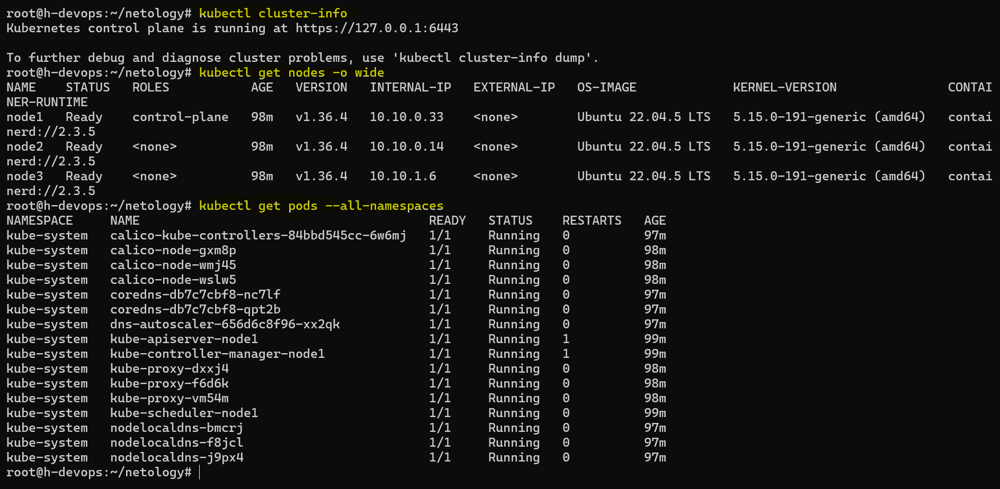

Все поды в namespace 'kube-system' должны быть в статусе 'Running':

**Преимущества автоматизации через Makefile**
1. **Воспроизводимость:** Любой участник команды может развернуть кластер одной командой
2. **Отсутствие ручных операций:** IP-адреса получаются автоматически из Terraform state
3. **Изоляция окружения:** Python-зависимости Kubespray не конфликтуют с системными пакетами
4. **Надежность:** Прямая генерация inventory не зависит от изменений в структуре репозитория Kubespray
5. **Безопасность:** Временные файлы удаляются, права на kubeconfig устанавливаются корректно
6. **Документация:** Makefile служит живой документацией процесса развертывания

## 3. Создание тестового приложения

Для эмуляции основного приложения компании было разработано легковесное веб-приложение на базе Nginx, отдающее статическую HTML-страницу. Весь код приложения, включая конфигурацию веб-сервера и Dockerfile, хранится в отдельном Git-репозитории, что соответствует принципам микросервисной архитектуры и требованиям диплома.

### 3.1 Создание git-репозитория с простым приложением (например, nginx со статикой)

#### Шаг 3.1.1: Создание структуры проекта и репозитория
Был создан новый изолированный Git-репозиторий (например, на GitHub/GitLab) с именем `netology-diploma-app`. В корне репозитория создана следующая структура файлов:

```text
netology-diploma-app/
├── index.html       # Статическая веб-страница
├── nginx.conf       # Пользовательская конфигурация Nginx
├── Dockerfile       # Инструкции для сборки контейнера
└── .gitignore       # Игнорирование временных файлов
```

Реестр контейнеров создается программно через Terraform в директории `stage3-registry/`.

**Файл:** [stage3-registry/main.tf](stage3-registry/main.tf)

```hcl
resource "yandex_container_registry" "diploma_registry" {
  name      = "${var.project_name}-registry"
  folder_id = var.folder_id
}
```

#### Шаг 3.1.2: Автоматизация сборки и публикации через Makefile

Весь процесс сборки Docker-образа и отправки его в Yandex Container Registry автоматизирован одной командой:

```bash
make build
```

**Что делает команда make build (пошагово):**
|Шаг|Действие|
|---|---|
1|Автоматически получает registry_id из terraform output папки stage3-registry|
2|Клонирует репозиторий с кодом приложения (или обновляет, если уже клонирован)|
3|Аутентифицирует Docker в YCR через IAM-токен (yc iam create-token)|
4|Собирает Docker-образ с двумя тегами: v1.0.0 и latest|
5|Отправляет оба тега в Yandex Container Registry|
6|Очищает локальные образы для экономии дискового пространства|

**Сборка с кастомной версией:**

```bash
make build APP_VERSION=v2.0.0
```

**Параметры, которые можно переопределить:**
 * **APP_NAME** — имя образа (по умолчанию: `netology-diploma-app`)
 * **APP_VERSION** — тег версии (по умолчанию: `v1.0.0`)
 * **APP_REPO_URL** — URL git-репозитория с кодом приложения

#### Шаг 3.1.3: Проверка результата

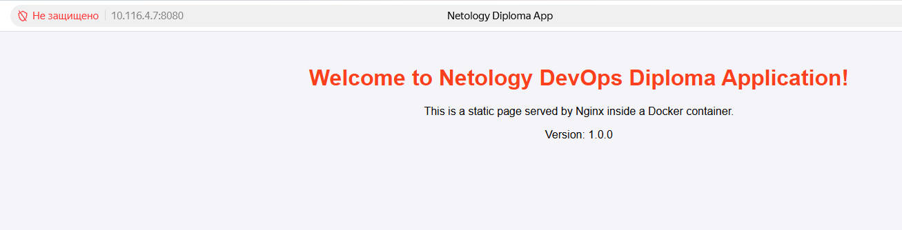

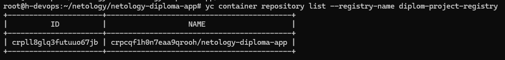

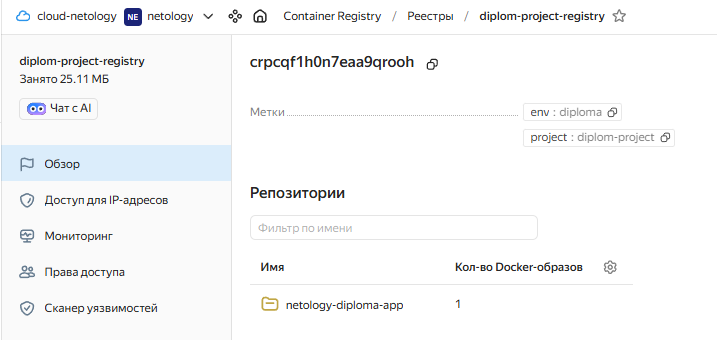

#### ⚠️ Важные замечания

1. **Перед запуском `make build` убедись, что:**
   - `yc` CLI установлен и авторизован (`yc config profile list`)
   - Registry создан (`terraform apply` в `stage3-registry` выполнен)
   - Docker daemon запущен (`docker info`)

## 4. Подготовка системы мониторинга и деплой приложения

Для управления конфигурацией Kubernetes создана отдельная директория `stage4-k8s-configs/`, содержащая Helm-значения и YAML-манифесты.

### 4.1 Установка стека мониторинга: Prometheus, Grafana, Alertmanager, Node Exporter (через kube-prometheus или Helm)
#### Шаг 4.1.1:  Выбор инструмента

Для установки выбран официальный Helm-чарт `kube-prometheus-stack` от Prometheus Community. Он автоматически развертывает операторов и все необходимые компоненты мониторинга, что соответствует рекомендуемым best practices.

#### Шаг 4.1.2:  Оптимизация ресурсов (Экономия бюджета)

Поскольку бюджет ограничен, в файле `stage4-k8s-configs/monitoring-values.yaml` жестко заданы `requests` и `limits` для всех подов. Например, Grafana ограничена 256Mi RAM, а Prometheus — 800Mi RAM. Также срок хранения метрик (retention) сокращен до 3 дней для экономии дискового пространства.

#### Шаг 4.1.3: Установка через Helm

Развертывание выполняется одной командой из Makefile:
```bash
make k8s-deploy
```
#### Нюансы аутентификации в Yandex Container Registry (YCR)
При автоматическом создании секрета `imagePullSecrets` для Kubernetes через Makefile критически важны два момента:
1. **Имя пользователя:** При аутентификации через IAM-токен параметр `--docker-username` должен быть строго равен `iam` (а не `json` или `oauth`).
2. **Очистка токена:** Команда `yc iam create-token` часто добавляет скрытый символ переноса строки (`\n`) в конец вывода. Если передать его в Kubernetes "как есть", base64-кодирование секрета будет некорректным, что приведет к ошибке `401 Unauthorized` при попытке скачать образ. 

Для решения этой проблемы в Makefile используется конвейер `tr -d '\n\r'`, который гарантирует передачу "чистого" токена:

```makefile
ycr_token=$$(yc iam create-token | tr -d '\n\r') && \
kubectl create secret docker-registry ycr-secret \
    --docker-server=cr.yandex \
    --docker-username=iam \
    --docker-password="$$ycr_token" \
    -n default --dry-run=client -o yaml | kubectl apply -f -
```


#### Шаг 4.1.4: Проверка результата
Тестовое приложение (Nginx со статической страницей) развернуто с использованием Deployment (2 реплики для высокой доступности) и Service (ClusterIP). Образ загружается из Yandex Container Registry с использованием imagePullSecrets.

**Файлы конфигурации:**
[stage4-k8s-configs/app-deployment.yaml](stage4-k8s-configs/app-deployment.yaml)
[stage4-k8s-configs/app-service.yaml](stage4-k8s-configs/app-service.yaml)
[stage4-k8s-configs/app-ingress.yaml](stage4-k8s-configs/app-ingress.yaml)

Поскольку кластер *self-hosted*, для доступа по 80 порту без использования платного Cloud Load Balancer, Ingress-контроллер настроен в режиме `hostNetwork=true`.

**Проверка доступа:**
В файл `hosts` локальной машины добавлена запись, сопоставляющая внешний IP ноды с доменами `grafana.diploma.local` и `app.diploma.local`.
**Grafana:** `http://grafana.diploma.local` (Логин: `admin`, Пароль получен через `kubectl get secret...`)
**Приложение:** `http://app.diploma.local`

Вывод команды `kubectl get pods -n monitoring` и `kubectl get pods -l app=netology-diploma-app`, подтверждающий статус `Running`.

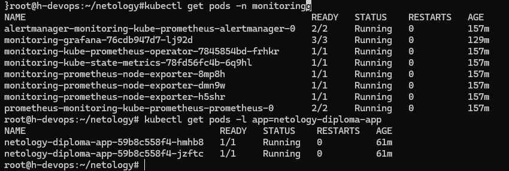

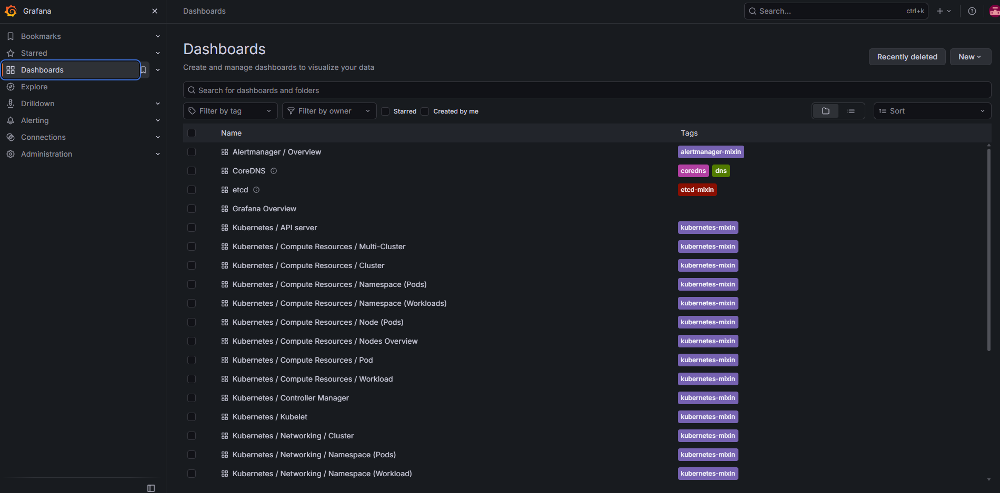

Веб-страница тестового приложения, доступная по HTTP на 80 порту.

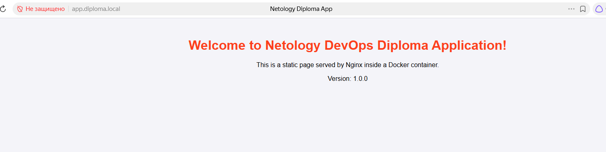

### 4.2 Деплой тестового приложения в кластер
#### Шаг 4.2.1: 
#### Шаг 4.2.2: 
#### Шаг 4.2.3:

### 4.3 Настройка доступа к Grafana и приложению по HTTP (порт 80)
#### Шаг 4.3.1: 
#### Шаг 4.3.2: 
#### Шаг 4.3.3:

### 4.4 Настройка CI/CD для инфраструктуры (Atlantis, Terraform Cloud или пайплайн в CI-системе)
#### Шаг 4.4.1: 
#### Шаг 4.4.2: 
#### Шаг 4.4.3:


## 5. Установка и настройка CI/CD
### 5.1 Настройка автоматической сборки Docker-образа при коммите в репозиторий приложения
#### Шаг 5.1.1: 
#### Шаг 5.1.2: 
#### Шаг 5.1.3:

### 5.2 Настройка автоматического деплоя нового образа в Kubernetes при создании тега (например, v1.0.0)
#### Шаг 5.2.1: 
#### Шаг 5.2.2: 
#### Шаг 5.2.3:

### 5.3 Использование Jenkins, GitLab CI, TeamCity или GitHub Actions.
#### Шаг 5.3.1: 
#### Шаг 5.3.2: 
#### Шаг 5.3.3:


